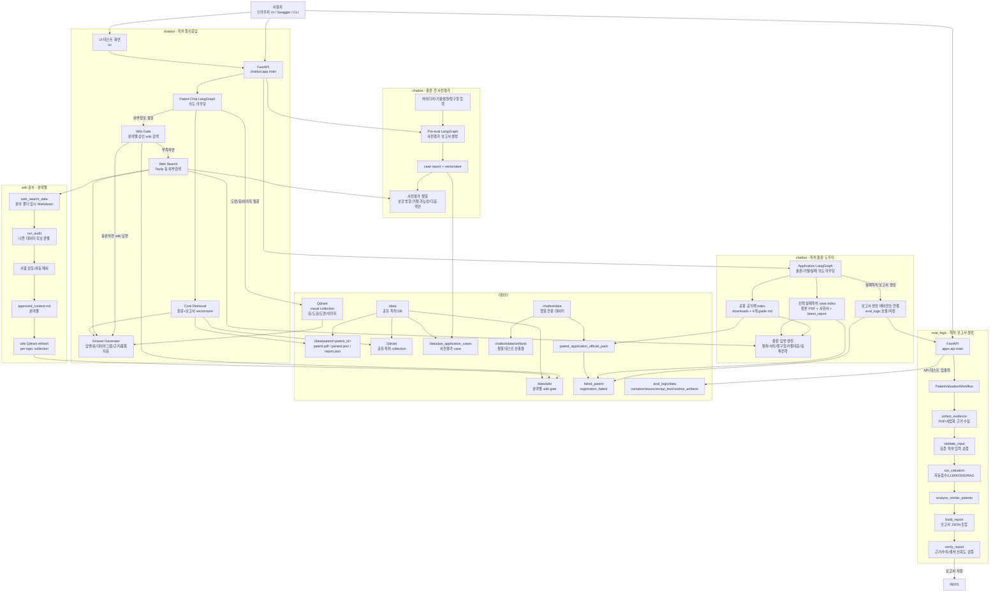

# SKIPA AI Server

특허 재평가 보고서 생성, 특허 RAG 챗봇, 특허 출원/실패 원인 분석 도우미, wiki 감사 및 vectorstore 갱신을 함께 제공하는 AI 백엔드입니다.

현재 구조는 `eval_logic`의 보고서 생성 workflow와 `chatbot`의 LangGraph 기반 답변 workflow가 데이터 폴더를 기준으로 연결되는 형태입니다. 보고서 생성 로직은 특허 PDF/JSON을 평가 보고서로 만들고, 챗봇은 특허 원문, 평가 보고서, 승인 wiki, 출원 공식팩, 실패특허 케이스별 보고서를 검색해 답변합니다.

## 핵심 기능

- 특허 PDF 또는 JSON 입력 기반 가치평가/재평가 보고서 생성
- 보고서 생성 후 자동 신뢰도 검증(`verify_report`) 및 `report_verification` 제공
- 특허별 원문 PDF, 표준 input JSON, 보고서 JSON, chunk, Qdrant vectorstore 통합 관리
- 가벼운 LLM 의도 라우팅 기반 특허 챗봇
- OpenAI 기반 의도 분류, 답변 생성, embedding 설정 지원
- Qdrant + OpenAI embedding 기반 retrieval
- 특허 원본 PDF의 표/도표/도면/이미지를 별도 visual Qdrant collection으로 관리. 기존 처리 특허는 manifest SHA1로 건너뛰고, 신규 특허만 매일 00시 증분 색인
- **분야별 wiki gate**: 웹검색 결과를 특허별이 아닌 기술 분야(소프트웨어_IT / 화학_소재 / 반도체_전자 등) 폴더로 관리하고, 감사 후 승인 데이터만 분야별 Qdrant collection에 반영. Tavily/web 검색 보강 포함. 매일 00시 자동 재빌드.
- 특허 출원 공식팩 기반 출원 도우미 챗봇
- 실패특허 원본 PDF 업로드, 선택 거절사유 업로드, 재평가 보고서 생성, 케이스별 vectorstore 분리
- 출원 전 아이디어/청구항 사전평가 보고서 생성 및 케이스별 챗봇
- Swagger UI와 브라우저 UI를 통한 기능 테스트

## 전체 아키텍처



## 디렉토리 구조

```text
skipers-ai/
  README.md

  eval_logic/
    README.md
    STRUCTURE.md
    requirements.txt
    src/
      apps/
        api/                 # 권장 FastAPI entrypoint
        cli/                 # 권장 CLI entrypoint
      api/                   # 기존 import/uvicorn 호환 wrapper
      cli/                   # 기존 CLI 호환 wrapper
      agent/                 # 보고서 생성 supervisor workflow
      services/              # 평가/근거수집/검증 서비스
      core/                  # 경로, schema, normalizer
      evaluation/            # 자동점수, LLM 평가, KOSIS, web
      patent_analysis/       # 유사 특허 분석
      document_processing/   # PDF 처리
      business_rag/          # 사업화 RAG
    data/
      samples/               # 샘플 입력/PDF/참조 데이터
      resources/             # 체크리스트, KSIC-IPC, RAG 리소스
      api_test/              # Swagger 테스트 입출력
      runtime_artifacts/     # CLI/agent 산출물
      legacy_artifacts/      # 이전 산출물/cache

  chatbot/
    README.md
    requirements.txt
    .env.example
    app/
      main.py                # 챗봇 FastAPI entrypoint
      config.py              # DATA_ROOT, 모델, 외부검색 설정
      application_data.py    # 출원 공식팩/실패특허 케이스/index 관리
      store.py               # 특허 데이터 조회/search helper
      routers/chatbot.py     # chatbot, patent-chat, wiki, application API
      agents/
        graph.py             # 특허 챗봇 LangGraph
        application_graph.py # 출원 도우미 LangGraph
        ingestion_graph.py   # 전처리/재색인 workflow
        wiki_graph.py        # wiki 감사 workflow
      legacy/                # rag.zip 기반 hybrid retrieval 복구 코드
      rag/                   # 현재 데이터 구조와 legacy RAG adapter
      wiki/
        topics.py            # 특허 제목 → 기술 분야 분류, topic 경로 헬퍼
        web_archive.py       # wiki 파일 목록 유틸
      static/                # /ui 화면
    data/
      README.md
      artifacts/             # 챗봇 검증/테스트 산출물 (루트 data/artifacts 사용 금지)
      patent_application_official_pack/
    docs/
      API_SPEC.md
      CHATBOT_ARCHITECTURE_AND_USAGE.md
    scripts/
      start_chatbot_server.sh
      preprocess_chatbot_data.sh

  data/
    patent/
      <patent_id>/            # 챗봇과 eval_logic이 공유하는 특허별 원본/보고서 DB
        patent.pdf
        parsed.json
        report.json
    qdrant collections        # 공유 특허 DB / wiki / 출원팩 / 실패특허 case index
    wiki/                     # 분야별 wiki vectorstore (WIKI_ROOT)
      _patent_topics.json
      소프트웨어_IT/
      화학_소재/
      반도체_전자/
      바이오_의료/
      기계_제조/
      에너지_환경/
      _general/
      _global/
    pre_application_cases/    # 출원 전 사전평가 케이스
```

## 데이터 계약

### 특허 챗봇 데이터

특허 원문과 보고서는 루트 공유 DB인 `data/patent/<patent_id>`에서 관리합니다. 챗봇과 `eval_logic`은 이 경로를 함께 참조합니다. K8s에서는 서버 시작 시 MinIO `s3://skipa/patent/`를 이 로컬 캐시에 동기화합니다.

```text
data/patent/<patent_id>/
  patent.pdf                # 특허 원문 PDF
  parsed.json               # 표준 특허 input JSON
  report.json               # eval_logic 평가/재평가 보고서 JSON
  *.html / *.md             # 생성된 보고서 뷰 또는 보조 문서

Qdrant collection:
  skipa_shared_patents        # data/patent 전체 공유 특허 DB
  skipa_patent_visuals        # patent.pdf에서 추출한 표/도표/도면/이미지 전용 DB
```

특허 원본 visual index는 보고서 생성 여부와 무관하게 `patent.pdf`만 있으면 처리합니다.

```text
data/patent/<patent_id>/
  patent.pdf
  extracted/
    assets/original_pdf/*.png           # 표/이미지/도면 crop
    visual_index_manifest.json          # patent.pdf SHA1, asset 수, Qdrant collection 기록

Qdrant collection:
  skipa_patent_visuals                  # payload에 asset_url, page_no, bbox, caption/OCR/문맥 저장
```

wiki는 특허별이 아닌 **기술 분야별** 공유 폴더로 관리합니다:

```text
data/wiki/                               ← WIKI_ROOT
  _patent_topics.json                    # {patent_id: topic_slug} 자동 캐시
  소프트웨어_IT/
    web_search_data/                     # 웹검색 raw draft (시간순 .md 파일)
    approved_context.md                  # 감사/자동 승인된 wiki 본문
    draft_index.json                     # 중복 검색 dedup 인덱스
    qdrant collection: skipa_wiki_topic_<topic_slug>
  화학_소재/
    (동일 구조)
  반도체_전자/ 바이오_의료/ 기계_제조/ 에너지_환경/ _general/
    (동일 구조)
  _global/
    qdrant collection: skipa_wiki_global # 전체 분야 병합 wiki vectorstore
```

중요한 규칙:

- 원문/보고서 질문은 Qdrant `skipa_shared_patents`와 해당 특허의 `patent.pdf`, `parsed.json`, `report.json`을 먼저 사용합니다.
- 도면/표/도표/이미지/다이어그램 질문은 Qdrant `skipa_patent_visuals`를 추가 검색하고, 검색된 asset URL을 근거 카드에 붙입니다.
- visual index는 원본 PDF SHA1 기반 manifest를 사용합니다. 원본은 변하지 않는 데이터로 보고, 매일 00:00 refresh 때 manifest가 없는 신규 특허 또는 Qdrant collection이 비어 있는 경우만 처리합니다.
- 신규 특허에 `report.json`이 없어도 visual index는 `patent.pdf`만으로 생성됩니다. 텍스트 평가 보고서 검색은 보고서 생성 후 별도로 반영됩니다.
- wiki는 core vectorstore에 섞지 않고 분야별 Qdrant collection으로만 관리합니다.
- 특허가 어느 분야인지는 제목 키워드 매칭으로 자동 결정하고 `_patent_topics.json`에 캐시합니다.
- wiki gate: 외부정보 필요 질문 → 해당 특허의 분야 wiki 먼저 검색 → 없으면 web 검색으로 넘어갑니다.
- web 검색 결과는 해당 특허의 분야 `web_search_data/` 에 저장됩니다. 관련도 임계값 이상이면 `approved_context.md`에 자동 추가하고 분야 vectorstore를 즉시 재빌드합니다.
- 매일 00:00 CronJob이 MinIO/local cache와 승인 wiki를 기준으로 Qdrant collection을 재빌드합니다 (`nightly_reindex_all`).
- 루트 `data/artifacts/`는 사용하지 않습니다. 챗봇 검증 산출물은 `chatbot/data/artifacts/`에만 저장합니다.

### 특허 출원 도우미 데이터

```text
chatbot/data/patent_application_official_pack/
  downloads/                                # 공식 PDF/웹문서
  patent_application_process_guide.md
  patent_rejection_failure_response.md
  patent_rejection_notice_original_sources.md
  prior_art_search_workflow.md
  index/qdrant/                              # 공용 공식팩 Qdrant manifest
  failed_patent/
    <registration_number>_failed/
      input/                                 # 실패특허 원본 PDF
      rejection/                             # 선택 거절의견서/사유서
      reports/                               # 재평가 보고서, latest_report.*
      index/qdrant/                          # 해당 실패특허 1건 전용 Qdrant manifest
      metadata.json
```

중요한 규칙:

- 출원 도우미는 채팅 전 실패특허 원본 PDF 업로드가 필요합니다.
- 공용 공식팩 index와 현재 선택한 실패특허 case index만 함께 검색합니다.
- 여러 실패특허는 절대 같은 vectorstore에 섞지 않습니다.
- 실패특허 보고서 생성 후에는 해당 case 폴더의 `reports/`에 저장하고 그 case index만 갱신합니다.

### eval_logic 데이터

`eval_logic`은 자체 API 테스트와 런타임 산출물을 `eval_logic/data` 아래에 둡니다.

```text
eval_logic/data/api_test/input/
eval_logic/data/api_test/output/reports/
eval_logic/data/runtime_artifacts/reports/
eval_logic/data/runtime_artifacts/graphs/
```

최종 보고서 파일명은 등록번호 기준입니다.

```text
{registration_number}.json
```

## 실행 방법

### Docker Image 빌드

```bash
cd /Users/kgw/skipers-ai
docker build -t skipa-ai:latest .
```

기본 이미지는 Kubernetes 배포를 기준으로 합니다.

- Ollama를 포함하지 않습니다.
- 기본 의도 분류는 OpenAI를 사용합니다.
- 기본 답변 생성은 OpenAI를 사용합니다.
- 기본 embedding은 OpenAI `text-embedding-3-large`를 사용합니다.
- `chatbot`과 `eval_logic`은 같은 이미지에서 실행하고, Kubernetes `command` 또는 `args`로 서비스만 선택합니다.

로컬 HuggingFace embedding과 BERTScore 패키지까지 이미지에 넣으려면 build arg를 켭니다. 이 옵션은 `torch` 계열 패키지를 포함하므로 이미지가 많이 커집니다.

```bash
docker build \
  --build-arg INSTALL_LOCAL_EMBEDDINGS=true \
  -t skipa-ai:local-embeddings .
```

### GitHub Actions 배포

`.github/workflows/deploy-ai.yml`은 `dev`와 `main` push, 또는 수동 실행(`workflow_dispatch`) 때 루트 `Dockerfile`로 Kubernetes용 이미지를 빌드합니다.

```text
image repository: amdp-registry.skala-ai.com/skala26a-ai2/skipa-ai
image tags:
  <branch>-<short_sha>
  <branch>-latest
infra manifest:
  skipers/skipa-infra/k8s/ai-backend/kustomization.yml 또는 kustomization.yaml
```

워크플로우가 하는 일:

- `linux/amd64` Docker image build
- Harbor registry push
- `skipers/skipa-infra` repository checkout
- `k8s/ai-backend` kustomization image tag 갱신
- infra repository `main` branch로 manifest update commit/push

GitHub Secrets:

```text
HARBOR_USERNAME
HARBOR_PASSWORD
INFRA_REPO_TOKEN
```

OpenAI, Tavily, MinIO, Qdrant API key는 image에 bake하지 않습니다. Kubernetes Secret/ConfigMap에서 runtime env로 주입합니다.

### Docker Image 로컬 검증

챗봇 서버:

```bash
docker run --rm \
  -p 8001:8001 \
  -e OPENAI_API_KEY="$OPENAI_API_KEY" \
  -e TAVILY_API_KEY="$TAVILY_API_KEY" \
  -e KIPRIS_API_KEY="$KIPRIS_API_KEY" \
  -e KOSIS_API_KEY="$KOSIS_API_KEY" \
  -e QDRANT_URL="${QDRANT_URL:-http://host.docker.internal:6333}" \
  -e QDRANT_API_KEY="$QDRANT_API_KEY" \
  -e MINIO_ENDPOINT="${MINIO_ENDPOINT:-http://host.docker.internal:19000}" \
  -e MINIO_ACCESS_KEY="$MINIO_ACCESS_KEY" \
  -e MINIO_SECRET_KEY="$MINIO_SECRET_KEY" \
  -e MINIO_BUCKET="${MINIO_BUCKET:-skipa}" \
  -e MINIO_PATENT_PREFIX="${MINIO_PATENT_PREFIX:-patent}" \
  -v "$PWD/data:/app/data" \
  -v "$PWD/chatbot/data:/app/chatbot/data" \
  -v "$PWD/chatbot/logs:/app/chatbot/logs" \
  -v "$PWD/eval_logic/data:/app/eval_logic/data" \
  skipa-ai:latest chatbot
```

접속 주소:

```text
챗봇 UI      http://127.0.0.1:8001/ui
챗봇 Swagger http://127.0.0.1:8001/docs
```

eval_logic 보고서 서버:

```bash
docker run --rm \
  -p 8000:8000 \
  -e OPENAI_API_KEY="$OPENAI_API_KEY" \
  -e TAVILY_API_KEY="$TAVILY_API_KEY" \
  -e KIPRIS_API_KEY="$KIPRIS_API_KEY" \
  -e KOSIS_API_KEY="$KOSIS_API_KEY" \
  -e QDRANT_URL="${QDRANT_URL:-http://host.docker.internal:6333}" \
  -e QDRANT_API_KEY="$QDRANT_API_KEY" \
  -v "$PWD/data:/app/data" \
  -v "$PWD/eval_logic/data:/app/eval_logic/data" \
  -v "$PWD/chatbot/data:/app/chatbot/data" \
  skipa-ai:latest eval-logic
```

접속 주소:

```text
보고서 Swagger http://127.0.0.1:8000/docs
```

health 확인:

```bash
curl http://127.0.0.1:8001/health
curl http://127.0.0.1:8000/health
```

재색인 CronJob과 동일한 작업을 로컬에서 한 번 실행:

```bash
docker run --rm \
  -e OPENAI_API_KEY="$OPENAI_API_KEY" \
  -e TAVILY_API_KEY="$TAVILY_API_KEY" \
  -e QDRANT_URL="${QDRANT_URL:-http://host.docker.internal:6333}" \
  -e QDRANT_API_KEY="$QDRANT_API_KEY" \
  -e MINIO_ENDPOINT="${MINIO_ENDPOINT:-http://host.docker.internal:19000}" \
  -e MINIO_ACCESS_KEY="$MINIO_ACCESS_KEY" \
  -e MINIO_SECRET_KEY="$MINIO_SECRET_KEY" \
  -e MINIO_BUCKET="${MINIO_BUCKET:-skipa}" \
  -e MINIO_PATENT_PREFIX="${MINIO_PATENT_PREFIX:-patent}" \
  -v "$PWD/data:/app/data" \
  -v "$PWD/chatbot/data:/app/chatbot/data" \
  -v "$PWD/chatbot/logs:/app/chatbot/logs" \
  -v "$PWD/eval_logic/data:/app/eval_logic/data" \
  skipa-ai:latest nightly-reindex
```

### Kubernetes 실행 기준

같은 이미지에서 두 Deployment를 나눠 띄웁니다.

챗봇 컨테이너:

```yaml
containers:
  - name: chatbot
    image: your-registry/skipa-ai:latest
    args: ["chatbot"]
    ports:
      - containerPort: 8001
    env:
      - name: OPENAI_API_KEY
        valueFrom:
          secretKeyRef:
            name: skipa-ai-secrets
            key: OPENAI_API_KEY
      - name: TAVILY_API_KEY
        valueFrom:
          secretKeyRef:
            name: skipa-ai-secrets
            key: TAVILY_API_KEY
      - name: QDRANT_URL
        value: http://skipa-qdrant:6333
      - name: QDRANT_API_KEY
        valueFrom:
          secretKeyRef:
            name: skipa-qdrant-secret
            key: api-key
      - name: MINIO_ENDPOINT
        value: http://skipa-minio:9000
      - name: MINIO_BUCKET
        value: skipa
      - name: MINIO_PATENT_PREFIX
        value: patent
      - name: MINIO_ACCESS_KEY
        valueFrom:
          secretKeyRef:
            name: skipa-minio-secret
            key: access-key
      - name: MINIO_SECRET_KEY
        valueFrom:
          secretKeyRef:
            name: skipa-minio-secret
            key: secret-key
```

eval_logic 컨테이너:

```yaml
containers:
  - name: eval-logic
    image: your-registry/skipa-ai:latest
    args: ["eval-logic"]
    ports:
      - containerPort: 8000
    env:
      - name: OPENAI_API_KEY
        valueFrom:
          secretKeyRef:
            name: skipa-ai-secrets
            key: OPENAI_API_KEY
      - name: QDRANT_URL
        value: http://skipa-qdrant:6333
      - name: QDRANT_API_KEY
        valueFrom:
          secretKeyRef:
            name: skipa-qdrant-secret
            key: api-key
```

Kubernetes에서는 아래 경로를 PVC 또는 object storage 동기화 대상으로 잡습니다.

```text
/app/chatbot/data
/app/chatbot/logs
/app/eval_logic/data
/app/data
```

매일 00:00 자동 감사/재색인은 같은 이미지를 `CronJob`으로 한 번 실행합니다. CronJob은 MinIO/local cache와 승인 wiki를 기준으로 Qdrant collection을 재빌드합니다.

```yaml
apiVersion: batch/v1
kind: CronJob
metadata:
  name: skipa-nightly-reindex
spec:
  schedule: "0 0 * * *"
  concurrencyPolicy: Forbid
  successfulJobsHistoryLimit: 3
  failedJobsHistoryLimit: 3
  jobTemplate:
    spec:
      template:
        spec:
          restartPolicy: OnFailure
          containers:
            - name: nightly-reindex
              image: your-registry/skipa-ai:latest
              args: ["nightly-reindex"]
              envFrom:
                - secretRef:
                    name: skipa-ai-secrets
              env:
                - name: QDRANT_URL
                  value: http://skipa-qdrant:6333
                - name: QDRANT_API_KEY
                  valueFrom:
                    secretKeyRef:
                      name: skipa-qdrant-secret
                      key: api-key
                - name: MINIO_ENDPOINT
                  value: http://skipa-minio:9000
                - name: MINIO_BUCKET
                  value: skipa
                - name: MINIO_PATENT_PREFIX
                  value: patent
                - name: MINIO_ACCESS_KEY
                  valueFrom:
                    secretKeyRef:
                      name: skipa-minio-secret
                      key: access-key
                - name: MINIO_SECRET_KEY
                  valueFrom:
                    secretKeyRef:
                      name: skipa-minio-secret
                      key: secret-key
              volumeMounts:
                - name: chatbot-data
                  mountPath: /app/chatbot/data
                - name: chatbot-logs
                  mountPath: /app/chatbot/logs
                - name: eval-logic-data
                  mountPath: /app/eval_logic/data
                - name: shared-data
                  mountPath: /app/data
          volumes:
            - name: chatbot-data
              persistentVolumeClaim:
                claimName: chatbot-data-pvc
            - name: chatbot-logs
              persistentVolumeClaim:
                claimName: chatbot-logs-pvc
            - name: eval-logic-data
              persistentVolumeClaim:
                claimName: eval-logic-data-pvc
            - name: shared-data
              persistentVolumeClaim:
                claimName: shared-data-pvc
```

### eval_logic 보고서 서버

```bash
cd /Users/kgw/skipers-ai/eval_logic
python3 -m venv .venv
source .venv/bin/activate
pip install -r requirements.txt
uvicorn apps.api.main:app --reload --app-dir src --port 8000
```

Swagger:

```text
http://127.0.0.1:8000/docs
```

기존 wrapper도 동작합니다.

```bash
uvicorn src.api.main:app --reload --port 8000
```

### 챗봇 UI/API 서버

```bash
cd /Users/kgw/skipers-ai
PYTHONPATH="$PWD" python3 -m uvicorn chatbot.app.main:app --reload --host 127.0.0.1 --port 8001
```

또는 helper script:

```bash
bash chatbot/scripts/start_chatbot_server.sh
```

UI와 Swagger:

```text
http://127.0.0.1:8001/ui
http://127.0.0.1:8001/docs
```

## 환경변수

실제 키는 커밋하지 않고 서버 루트의 `.env`에 둡니다. `eval_logic`도 이
공통 `.env`를 먼저 읽습니다.

챗봇 주요 변수:

```env
DATA_ROOT=/Users/kgw/skipers-ai/chatbot/data
SHARED_DATA_ROOT=/Users/kgw/skipers-ai/data
SHARED_PATENT_ROOT=/Users/kgw/skipers-ai/data/patent
PATENTS_ROOT=/Users/kgw/skipers-ai/chatbot/data/mapped_patent_reports   # 호환용 legacy RAG 폴더
PATENT_APPLICATION_ROOT=/Users/kgw/skipers-ai/chatbot/data/patent_application_official_pack
WIKI_ROOT=/Users/kgw/skipers-ai/data/wiki
PRE_EVAL_ROOT=/Users/kgw/skipers-ai/data/pre_application_cases

MINIO_ENDPOINT=http://skipa-minio:9000
MINIO_ACCESS_KEY=minioadmin
MINIO_SECRET_KEY=...
MINIO_BUCKET=skipa
MINIO_PATENT_PREFIX=patent
MINIO_SYNC_ON_STARTUP=true

QDRANT_URL=http://skipa-qdrant:6333
QDRANT_API_KEY=...
QDRANT_COLLECTION_PREFIX=skipa
QDRANT_VECTOR_SIZE=3072

ENABLE_VISUAL_ASSET_EXTRACTION=true
ENABLE_VISUAL_BASE64=true
MAX_VISUAL_ASSETS_PER_DOCUMENT=80

INTENT_PROVIDER=openai
OPENAI_INTENT_MODEL=gpt-4.1-mini

ANSWER_PROVIDER=openai
OPENAI_API_KEY=...
OPENAI_ANSWER_MODEL=gpt-4.1
OPENAI_EMBEDDING_MODEL=text-embedding-3-large
EMBEDDING_PROVIDER=openai

TAVILY_API_KEY=...
ENABLE_WEB_SEARCH=true
```

eval_logic 주요 변수:

```env
OPENAI_API_KEY=...
KOSIS_API_KEY=...
KIPRIS_API_KEY=...
KSIC_TABLE_PATH=data/resources/산업_KSIC_-특허_IPC__연계표.xlsx
```

## 주요 API

상세 요청/응답 스키마와 Swagger 테스트 순서는 [API 명세서](chatbot/docs/API_SPEC.md)에 정리되어 있습니다. 아래는 운영 중 가장 자주 쓰는 엔드포인트 요약입니다.

### eval_logic 보고서 생성

```text
GET  /health
POST /api/v1/reports/patent-valuation/from-json
POST /api/v1/reports/patent-valuation/from-json-file
POST /api/v1/reports/patent-valuation/from-pdf
GET  /api/v1/reports/{job_id}
GET  /api/v1/reports/{job_id}/status
GET  /api/v1/reports/{job_id}/result
```

Tool API:

```text
POST /api/v1/tools/patent-metadata
POST /api/v1/tools/business-rag
POST /api/v1/tools/market-growth
POST /api/v1/tools/auto-score
POST /api/v1/tools/llm-evaluation
POST /api/v1/tools/similar-patents
```

Dev API (개발/샘플 테스트용):

```text
POST /api/v1/dev/patent-valuation/evaluate
POST /api/v1/dev/patent-valuation/evaluate-sample
```

### 챗봇 관리

```text
GET  /api/v1/chatbot/config
GET  /api/v1/chatbot/data-links
GET  /api/v1/chatbot/patents
GET  /api/v1/chatbot/patents/{patent_id}
GET  /api/v1/chatbot/patents/{patent_id}/files
GET  /api/v1/chatbot/patents/{patent_id}/input/latest
GET  /api/v1/chatbot/patents/{patent_id}/report/latest
GET  /api/v1/chatbot/patents/{patent_id}/chunks
GET  /api/v1/chatbot/business/chunks
GET  /api/v1/chatbot/vectorstore/status
GET  /api/v1/chatbot/preprocess/status
GET  /api/v1/chatbot/minio/status
POST /api/v1/chatbot/minio/sync
GET  /api/v1/chatbot/qdrant/status
GET  /api/v1/chatbot/visual-vectorstore/status
POST /api/v1/chatbot/visual-vectorstore/refresh
POST /api/v1/chatbot/visual-vectorstore/search
POST /api/v1/chatbot/preprocess/run
POST /api/v1/chatbot/vectorstore/refresh
POST /api/v1/chatbot/search
POST /api/v1/chatbot/query
POST /api/v1/chatbot/answer
```

### 특허 챗봇

```text
GET  /api/v1/patent-chat/patents
GET  /api/v1/patent-chat/patent-summary-cards
GET  /api/v1/patent-chat/engine/status
POST /api/v1/patent-chat/chat
POST /api/v1/patent-chat/global/chat
POST /api/v1/patent-chat/query
POST /api/v1/patent-chat/answer
POST /api/v1/patent-chat/reindex
POST /api/v1/patent-chat/global/reindex
POST /api/v1/patent-chat/business/reindex
POST /api/v1/patent-chat/feedback
GET  /api/v1/patent-chat/page-image
GET  /api/v1/patent-chat/chat/mermaid
GET  /api/v1/patent-chat/ingestion/mermaid
```

`/api/v1/rag`와 `/rag`는 호환 alias입니다. 기능 기준 이름은 `patent-chat`입니다.

### wiki 감사 및 분야별 vectorstore

```text
# 분야별 wiki vectorstore 관리
GET  /api/v1/wiki/topics                     분야 목록 및 vectorstore 상태
GET  /api/v1/wiki/topics/{topic_slug}        특정 분야 상세 (approved_context 미리보기, 최근 draft)
POST /api/v1/wiki/topics/refresh             모든 분야 wiki Qdrant vectorstore 재빌드
GET  /api/v1/wiki/topics/{topic_slug}/patent?patent_id=X   특허 → 분야 매핑 확인

# 데이터 감사 (품질 검사 → 사람 검토 → 승인)
POST /api/v1/wiki/audit
GET  /api/v1/wiki/audit-review
GET  /api/v1/wiki/audit-report
POST /api/v1/wiki/audit-apply
POST /api/v1/wiki/audit-auto-refresh

# LangGraph agent 직접 실행
POST /api/v1/wiki/agent/run
GET  /api/v1/wiki/agent/mermaid
```

`POST /api/v1/chatbot/preprocess/run`에서 `mode: "nightly_reindex"`를 보내면 Kubernetes CronJob과 같은 작업을 Swagger에서도 수동 실행할 수 있습니다.

### 특허 출원 도우미

```text
GET  /api/v1/application/status
GET  /api/v1/application/external/status
POST /api/v1/application/preprocess
POST /api/v1/application/index/refresh
POST /api/v1/application/feedback/create
POST /api/v1/application/feedback/upload
POST /api/v1/application/report/generate
POST /api/v1/application/sources/download
GET  /api/v1/application/sources/download-report
POST /api/v1/application/chat
GET  /api/v1/application/chat/mermaid

GET  /api/v1/application/failed-patents
POST /api/v1/application/failed-patents/upload
POST /api/v1/application/failed-patents/create
GET  /api/v1/application/failed-patents/{case_id}
POST /api/v1/application/failed-patents/{case_id}/report/generate
POST /api/v1/application/failed-patents/{case_id}/report/save
POST /api/v1/application/failed-patents/{case_id}/index/refresh
POST /api/v1/application/failed-patents/{case_id}/chat
```

### 출원 전 사전평가

```text
POST /api/v1/pre-eval/evaluate
GET  /api/v1/pre-eval/cases
GET  /api/v1/pre-eval/cases/{case_id}
GET  /api/v1/pre-eval/cases/{case_id}/report
POST /api/v1/pre-eval/cases/{case_id}/index/refresh
POST /api/v1/pre-eval/cases/{case_id}/chat
POST /api/v1/pre-eval/cases/{case_id}/search
GET  /api/v1/pre-eval/graph/mermaid
```

## workflow 요약

### 보고서 생성

```text
supervisor
 -> collect_evidence
 -> validate_input
 -> run_valuation
 -> analyze_similar_patents
 -> build_report
 -> verify_report
 -> END
```

`verify_report`는 근거 커버리지, LLM 평가 항목 출처, 고평가 항목 근거, 수치 무결성, 공식/전문 출처 비율, 사업화 RAG 누락, 유사특허 분석 누락을 검증합니다.

### 특허 챗봇

```text
질문
 -> chat_history 반영
 -> OpenAI 기반 가벼운 의도 분류
 -> 원문/보고서 검색 또는 wiki gate 또는 web 검색 결정
 -> 도면/표/이미지 의도면 visual Qdrant collection 추가 검색
 -> OpenAI 답변 생성
 -> 표/다이어그램/체크리스트 형식화 + visual asset 근거 카드 연결
 -> 근거 카드와 품질 지표 반환
```

### 출원 도우미

```text
실패특허 PDF 업로드
 -> <registration>_failed case 생성
 -> 공용 공식팩 index 준비
 -> case 전용 index 준비
 -> 필요 시 eval_logic 보고서 생성
 -> latest_report를 case reports에 저장
 -> case index만 refresh
 -> 공식팩 index + 선택 case index + web 검색으로 답변
```

### wiki 감사 (분야별)

```text
웹검색 결과 → WIKI_ROOT/{topic}/web_search_data/ 저장
 ├─ 관련도 ≥ 0.50 → approved_context.md 자동 추가 + 분야 vectorstore 즉시 재빌드
 └─ 관련도 < 0.50 → pending 상태로 draft_index.json에 기록

audit 실행 → 나쁜 데이터 후보 추출
 -> 사람 검토 또는 자동 제외
 -> approved_context.md 저장
 -> 분야별 Qdrant collection 재빌드

매일 00:00 CronJob (nightly_reindex_all)
 -> 모든 분야 wiki vectorstore 재빌드
 -> Qdrant `skipa_wiki_global` 병합 재빌드
 -> 신규/누락 특허 원본 PDF의 visual asset만 증분 추출 및 `skipa_patent_visuals` 갱신

다음 외부정보 질문에서 해당 분야 wiki gate로 사용
```

## 전처리와 재색인 명령

```bash
cd /Users/kgw/skipers-ai

# 전체 상태 확인
bash chatbot/scripts/preprocess_chatbot_data.sh --mode status

# 특허 챗봇 core/wiki refresh
bash chatbot/scripts/preprocess_chatbot_data.sh --mode refresh

# 신규 특허 원본 PDF의 표/도표/도면/이미지만 증분 색인
bash chatbot/scripts/preprocess_chatbot_data.sh --mode visual-index

# visual index를 강제로 전체 재생성
bash chatbot/scripts/preprocess_chatbot_data.sh --mode visual-index --force

# wiki 자동 감사 후 승인 데이터만 refresh
bash chatbot/scripts/preprocess_chatbot_data.sh --mode auto-audit

# 매일 00:00 CronJob에서 실행할 전체 Qdrant 재색인 작업
bash chatbot/scripts/preprocess_chatbot_data.sh --mode nightly-reindex

# 출원 공식팩 전처리 및 공용 index 갱신
bash chatbot/scripts/preprocess_chatbot_data.sh --mode application-preprocess

# 실패특허 case 생성
bash chatbot/scripts/preprocess_chatbot_data.sh --mode application-case \
  --original-pdf "/path/to/failed_patent.pdf" \
  --rejection-file "/path/to/rejection_notice.pdf"

# 실패특허 보고서 생성 후 해당 case index만 갱신
bash chatbot/scripts/preprocess_chatbot_data.sh --mode application-case-generate \
  --case-id "10-1959619_failed"
```

## 문서

- [eval_logic README](eval_logic/README.md)
- [chatbot README](chatbot/README.md)
- [API 명세서](chatbot/docs/API_SPEC.md)
- [챗봇 전체 아키텍처와 사용설명서](chatbot/docs/CHATBOT_ARCHITECTURE_AND_USAGE.md)
- [챗봇 데이터 README](chatbot/data/README.md)
- [특허 출원 공식팩 README](chatbot/data/patent_application_official_pack/README.md)
- [eval_logic 구조 요약](eval_logic/STRUCTURE.md)

## 커밋 전 확인

```bash
git status --short
git diff --check
```

다음 파일은 커밋하지 않습니다.

```text
chatbot/.env
eval_logic/.env
eval_logic/.env.*
.env
.env.*
```
