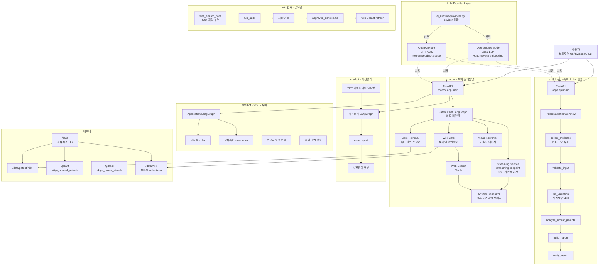

# SKIPA AI Server

특허 가치평가 보고서 자동 생성, RAG 기반 특허 챗봇, 출원 도우미, 출원 전 사전평가, wiki 감시 및 vectorstore 관리를 함께 제공하는 AI 백엔드입니다.

**현재 구현 상태 (2026-06-19):**
- ✅ 185개 특허 가치평가 보고서 생성 완료
- ✅ LangGraph 기반 다중 챗봇 시스템 (특허 질의응답, 출원 도우미, 사전평가)
- ✅ Qdrant 멀티 vectorstore 운영 (특허/wiki/시각자료)
- ✅ 분야별 wiki 감시 및 자동 승인 시스템
- ✅ OpenAI/Local LLM 듀얼 모드 지원 (OpenSource 전환 가능)
- ✅ 스트리밍 답변 및 실시간 응답 기능
- ✅ 광범위한 테스트 커버리지

구조는 `eval_logic`의 보고서 생성 workflow와 `chatbot`의 LangGraph 기반 답변 workflow가 공유 데이터(`/data`)를 중심으로 연결됩니다. 각 모듈은 독립적으로 실행 가능하며 FastAPI 또는 CLI로 제어되며, **OpenAI와 Local LLM 간 자유롭게 전환** 가능합니다.

## 핵심 기능

### 보고서 생성 (eval_logic)
- **특허 입력**: PDF 또는 JSON 기반 특허 정보 수집
- **자동 평가**: 권리성/기술성/시장성/사업성 4가지 축으로 종합점수(0~100점) 및 등급(A/B/C) 산출
- **근거 검증**: LLM 평가 항목별 출처 확인, 고평가 항목 근거, 수치 무결성 자동 검증
- **유사특허 분석**: 최근 20년 관련 특허 자동 수집 및 분석
- **LLM Provider 선택**: OpenAI 또는 Local LLM (ollama/vLLM) 선택 가능

### 특허 챗봇 (chatbot - Patent Chat)
- **다중 의도 라우팅**: 원문/보고서/외부정보 질문 자동 분류
- **멀티 vectorstore**: 텍스트(Qdrant) + 시각자료(visual collection) + wiki + web 검색
- **스트리밍 응답**: `/streaming` endpoint로 실시간 토큰 기반 답변
- **시각자료 지원**: 도면/표/이미지 추출 및 근거 카드 연결
- **신뢰도 지표**: 답변 품질 및 출처 신뢰도 자동 계산

### 출원 도우미 (chatbot - Application Assistant)
- **공식팩 기반**: 출원/거절대응/등록전략 가이드 4개 + 다운로드 자료
- **실패특허 케이스**: 원본 PDF + 거절의견서/사유서 + 재평가 보고서 case별 관리
- **보고서 자동 생성**: eval_logic 연결로 실패특허 재평가 보고서 즉시 생성
- **답변**: 공식팩 + case index + web 검색으로 절차/서식/청구항/거절대응 지원

### 출원 전 사전평가 (chatbot - Pre-Evaluation)
- **입력**: 아이디어/기술설명/청구항 텍스트
- **평가 보고서**: eval_logic 기반 사전평가 종합 보고서 생성
- **사전평가 챗봇**: case별 vectorstore + web 검색으로 보강 방향/거절 가능성 제시

### wiki 감시 및 분야별 관리 (chatbot - Wiki Gate)
- **분야 분류**: 특허 제목 키워드로 기술 분야 자동 결정 (소프트웨어_IT/화학_소재/반도체_전자 등 7개)
- **웹검색 수집**: Tavily 검색 → 분야별 `web_search_data/` 저장 (400+ 파일 누적)
- **자동 감시**: 나쁜 데이터 후보 판별 → 사람 검토 또는 자동 제외
- **승인 및 색인**: approved_context.md 저장 → 분야별 Qdrant collection 즉시 재빌드
- **매일 00시**: CronJob으로 신규/누락 특허 visual asset 증분 추출

### LLM Provider 및 배포 모드
- **OpenAI 모드** (기본): GPT-4/3.5 + text-embedding-3-large
- **OpenSource 모드**: Local LLM (ollama/vLLM) + Local embedding (HuggingFace)
  - `scripts/start_opensource_models.sh`: 로컬 LLM/embedding 자동 시작
  - `scripts/run_ai_mode.sh`: 모드 선택 및 실행
  - `ai_runtime/providers.py`: Provider 통합 관리
  - `ai_runtime/modes/opensource.env.example`: OpenSource 설정 템플릿

### 운영 및 테스트
- **Swagger UI**: eval_logic + chatbot 모두 `/docs`에서 API 테스트
- **상태 조회 API**: vectorstore/wiki/visual index/전처리 상태 실시간 확인
- **광범위한 테스트**: RAG 품질/스트리밍/스키마/저장소 테스트 (18개 파일)
- **RAG 최적화**: `scripts/auto_optimize_retrieval.py`로 retrieval 성능 평가 및 최적화

## 전체 아키텍처



## 디렉토리 구조

```text
skipa-ai-server/
  README.md (이 파일)

  eval_logic/                 # 보고서 생성 엔진
    src/
      apps/
        api/main.py          # FastAPI entrypoint
        cli/                 # CLI entrypoint
      agent/                 # 보고서 생성 workflow
      services/              # 평가/근거수집/검증
      core/                  # schema, normalizer
      evaluation/            # 자동점수, LLM, KOSIS
      patent_analysis/       # 유사 특허 분석
      document_processing/   # PDF 처리
      business_rag/          # 사업화 근거 RAG
      providers/llm.py       # LLM provider 추상화
      workers/               # RabbitMQ 워커
    data/
      samples/, resources/, api_test/, runtime_artifacts/

  chatbot/                    # 특허 챗봇 및 도우미
    app/
      main.py                # FastAPI entrypoint
      config.py              # 경로, 모델 설정
      routers/chatbot.py     # API 엔드포인트
      agents/
        graph.py             # 특허 챗봇 LangGraph
        application_graph.py # 출원 도우미 LangGraph
        pre_eval_graph.py    # 사전평가 LangGraph
        wiki_context_agent.py # wiki 감시 LangGraph
      streaming/
        openai_stream.py     # OpenAI 스트리밍
        router.py            # /streaming endpoint
        service.py, sse.py   # SSE 서비스
      rag/
        llm.py               # RAG용 LLM 관리
        pipeline.py          # retrieval pipeline
      wiki/
        topics.py            # 분야 분류
        web_archive.py       # wiki 파일 관리
      provider_env.py        # Provider 환경 관리
      shared_data.py         # 공유 데이터 관리
    data/
      artifacts/             # 테스트/검증 산출물
      patent_application_official_pack/
        downloads/, failed_patent/
      rag_eval/              # RAG 평가 결과
    scripts/
      auto_optimize_retrieval.py  # retrieval 최적화
      eval_rag.py            # RAG 평가
      start_chatbot_server.sh
      preprocess_chatbot_data.sh

  pre_application_valuation/  # 사전평가 독립 모듈
    api.py, schemas.py, service.py
    llm_evaluator.py, report_builder.py, scoring.py
    text_normalizer.py, worker.py
    providers/llm.py         # LLM provider 추상화
    outputs/answer.json, example.json

  ai_runtime/                 # AI 런타임 관리
    README.md
    providers.py             # Provider 통합 (OpenAI/Local)
    modes/
      README.md
      opensource.env.example # OpenSource 설정

  unified_api/                # 통합 API (기획/구현 중)
    main.py

  ai-insights/                # AI 인사이트
    app/providers/llm.py     # Provider 추상화

  patents/                    # 특허 데이터 (185개)
    <id>/
      original.pdf
      parsed.json
      reports/<id>/report.json
    patents_summary.csv      # ID/점수/등급 요약

  data/
    patent/<id>/             # 공유 특허 DB
    wiki/                    # 분야별 wiki
      _general/, 소프트웨어_IT/, 화학_소재/, 반도체_전자/ 등
      web_search_data/       # 웹검색 원본 (400+ 파일)
      approved_context.md    # 승인 wiki
    pre_application_cases/

  scripts/                    # 배치 작업
    start_opensource_models.sh   # Local LLM/embedding 시작
    run_ai_mode.sh              # 모드 선택 실행
    serve_embedding.py          # embedding 모델 서빙
    serve_llm_cpu.py            # LLM 모델 서빙
    serve_reranker.py           # reranker 서빙
    download_llm_gguf.sh        # 모델 다운로드
    (기타 배치 스크립트)

  tests/                      # 광범위한 테스트
    chatbot/
      rag/test_quality.py, test_sources.py, 등
      streaming/test_sse.py
      test_public_schemas.py
    eval_logic/test_core_schemas.py
    pre_application_valuation/
      test_report_builder.py, test_schemas.py, 등
    conftest.py

  .github/workflows/
    deploy-ai.yml            # K8s 배포
    deploy-model-serving.yml # 모델 서빙 배포

  Dockerfile                  # K8s용 이미지 (OpenAI 모드 기본)
  requirements-dev.txt
  pytest.ini
```

## 환경 모드

### OpenAI 모드 (기본)

```bash
cd /Users/knh/workspace/skipa/skipa-ai-server

# 챗봇 서버 실행
PYTHONPATH="$PWD" python3 -m uvicorn chatbot.app.main:app --reload --port 8001

# eval_logic 서버 실행
cd eval_logic
python3 -m venv .venv
source .venv/bin/activate
pip install -r requirements.txt
uvicorn apps.api.main:app --reload --app-dir src --port 8000
```

**필요한 환경변수:**
```env
OPENAI_API_KEY=sk-...
TAVILY_API_KEY=...
QDRANT_URL=http://localhost:6333
QDRANT_API_KEY=...
```

### OpenSource 모드 (Local LLM/embedding)

```bash
# 1. 로컬 LLM 및 embedding 시작
bash scripts/start_opensource_models.sh

# 2. 모드 선택하여 실행
bash scripts/run_ai_mode.sh --mode opensource
```

**설정:** `ai_runtime/modes/opensource.env.example` 참고

- **LLM**: ollama/vLLM (Llama-2, Mistral 등)
- **Embedding**: HuggingFace (jina-base-zh 등)
- **Reranker**: BGE-reranker-base

## 주요 API

### eval_logic 보고서 생성
```text
POST /api/v1/reports/patent-valuation/from-json
POST /api/v1/reports/patent-valuation/from-pdf
GET  /api/v1/reports/{job_id}
POST /api/v1/tools/similar-patents
```

### 특허 챗봇
```text
POST /api/v1/chatbot/query       # 일반 답변
POST /api/v1/chatbot/stream      # 스트리밍 답변 (/streaming)
GET  /api/v1/chatbot/patents/{patent_id}
POST /api/v1/patents/{patent_id}/chat  # 특허별 재평가 챗봇
```

### 출원 도우미
```text
GET  /api/v1/application/status
POST /api/v1/application/failed-patents/upload
POST /api/v1/application/failed-patents/{case_id}/report/generate
POST /api/v1/application/chat
```

### 사전평가
```text
POST /api/v1/pre-eval/evaluate
GET  /api/v1/pre-eval/cases/{case_id}
POST /api/v1/pre-eval/cases/{case_id}/chat
```

### wiki 감시
```text
GET  /api/v1/wiki/topics
POST /api/v1/wiki/audit
GET  /api/v1/wiki/audit-report
```

상세 요청/응답은 `/docs` (Swagger) 또는 `chatbot/docs/API_SPEC.md` 참고.

## 실행 및 배포

### Docker (OpenAI 모드)

```bash
docker run --rm \
  -p 8001:8001 \
  -e OPENAI_API_KEY="$OPENAI_API_KEY" \
  -e TAVILY_API_KEY="$TAVILY_API_KEY" \
  -e QDRANT_URL=http://host.docker.internal:6333 \
  -v "$PWD/data:/app/data" \
  skipa-ai:latest chatbot

docker run --rm \
  -p 8000:8000 \
  -e OPENAI_API_KEY="$OPENAI_API_KEY" \
  -v "$PWD/data:/app/data" \
  skipa-ai:latest eval-logic
```

### Kubernetes

챗봇 및 eval_logic 각각 별도 Deployment로 배포. 매일 00:00 CronJob으로 wiki/visual index 재빌드.

```yaml
# CronJob: nightly-reindex
schedule: "0 0 * * *"
image: skipa-ai:latest
args: ["nightly-reindex"]
```

### GitHub Actions

`.github/workflows/deploy-ai.yml`: dev/main push 또는 수동 실행 시
- Linux amd64 Docker image 빌드
- Harbor registry push
- K8s manifest 자동 갱신

## 현재 구현 상태 (2026-06-19)

### ✅ 완료

**보고서 생성**
- 185개 특허 전수 가치평가 보고서 생성
- 4축(권리성/기술성/시장성/사업성) 자동 평가 및 LLM 검증
- 유사특허 자동 분석 및 근거 신뢰도 검증

**특허 챗봇**
- LangGraph 기반 3가지 라우팅 경로
- Qdrant 멀티 vectorstore (텍스트/시각/wiki)
- 스트리밍 응답 및 실시간 토큰 기반 답변

**출원/사전평가 챗봇**
- 공식팩 기반 출원 도우미
- 실패특허 케이스별 관리
- 아이디어 기반 사전평가 보고서 생성

**wiki 감시**
- 7개 기술 분야 + _general 자동 분류
- 400+ 웹검색 결과 누적
- 분야별 Qdrant collection 자동 재빌드

**LLM Provider 통합**
- OpenAI 모드 기본 운영
- OpenSource 모드 설정 완료 (Local LLM/embedding 선택 가능)
- Provider 추상화로 자유로운 전환 가능

**테스트 및 최적화**
- RAG 품질/스트리밍/스키마 18개 테스트 파일
- retrieval 자동 최적화 스크립트
- RAG 평가 워크플로우

### 🔄 부분 구현

- **통합 API**: unified_api 기획 중
- **모델 서빙**: 로컬 LLM/embedding 서빙 스크립트 작성됨
- **배치 운영**: 대량 보고서 생성 및 검증 기능

### 🚀 배포

- ✅ Docker: K8s용 이미지 준비
- ✅ GitHub Actions: 자동 빌드/푸시
- ✅ K8s: CronJob 설정 가능
- ✅ 로컬: 모드 선택 실행 가능

## 문서

- [eval_logic README](eval_logic/README.md)
- [chatbot README](chatbot/README.md)
- [API 명세서](chatbot/docs/API_SPEC.md)
- [chatbot 아키텍처](chatbot/docs/CHATBOT_ARCHITECTURE_AND_USAGE.md)
- [ai_runtime 가이드](ai_runtime/README.md)
- [OpenSource Provider 변경사항](docs/opensource_provider_changes.md)
- [pytest.ini](pytest.ini)

## 주요 스크립트

```bash
# OpenSource 모드
bash scripts/start_opensource_models.sh    # 로컬 LLM/embedding 시작
bash scripts/run_ai_mode.sh                # 모드 선택 실행

# 최적화 및 평가
python scripts/auto_optimize_retrieval.py  # retrieval 최적화
python scripts/eval_rag.py                 # RAG 품질 평가

# 모델 서빙 (standalone)
python scripts/serve_embedding.py          # embedding 모델
python scripts/serve_llm_cpu.py            # LLM 모델
python scripts/serve_reranker.py           # reranker

# 기타
bash scripts/parse_global_patents.py       # 특허 일괄 파싱
bash scripts/download_llm_gguf.sh          # GGUF 모델 다운로드
```

## 커밋 전 확인

```bash
git status --short
git diff --check
```

다음 파일은 커밋하지 않습니다:

```text
chatbot/.env
eval_logic/.env
eval_logic/.env.*
.env
.env.*
```

## 변경 이력

### v2 (2026-06-19, dev 브랜치)
- OpenAI/Local LLM 듀얼 모드 지원
- 스트리밍 답변 기능 추가 (/streaming endpoint)
- 광범위한 테스트 커버리지 추가 (18개 파일)
- RAG 자동 최적화 스크립트
- wiki 데이터 400+ 파일 누적
- UI 구조 재설계
- RabbitMQ 워커 및 배포 최적화

### v1 (2026-06-18, main 브랜치)
- 기본 보고서 생성 및 특허 챗봇 구현
- wiki 감시 시스템
- 출원 도우미 및 사전평가 기능
