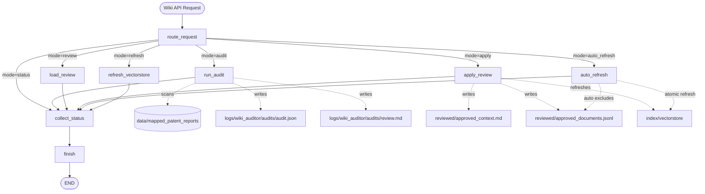
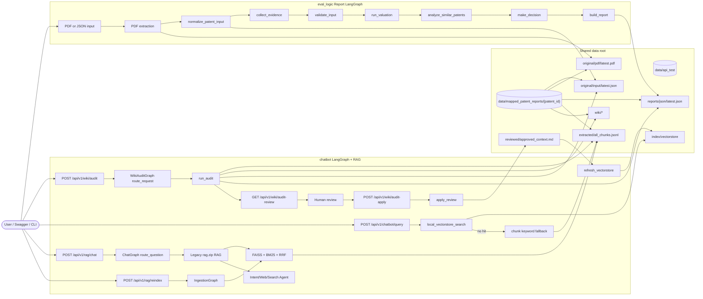
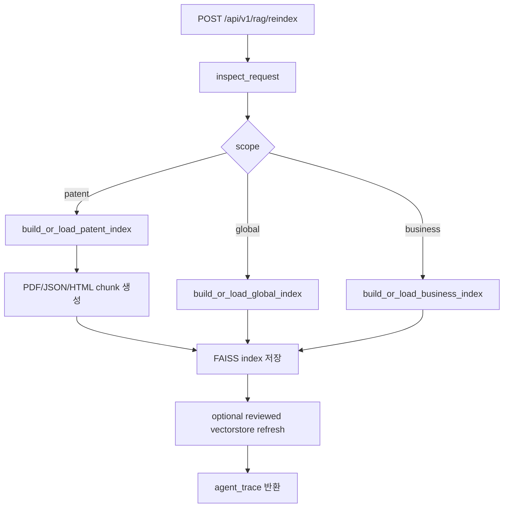
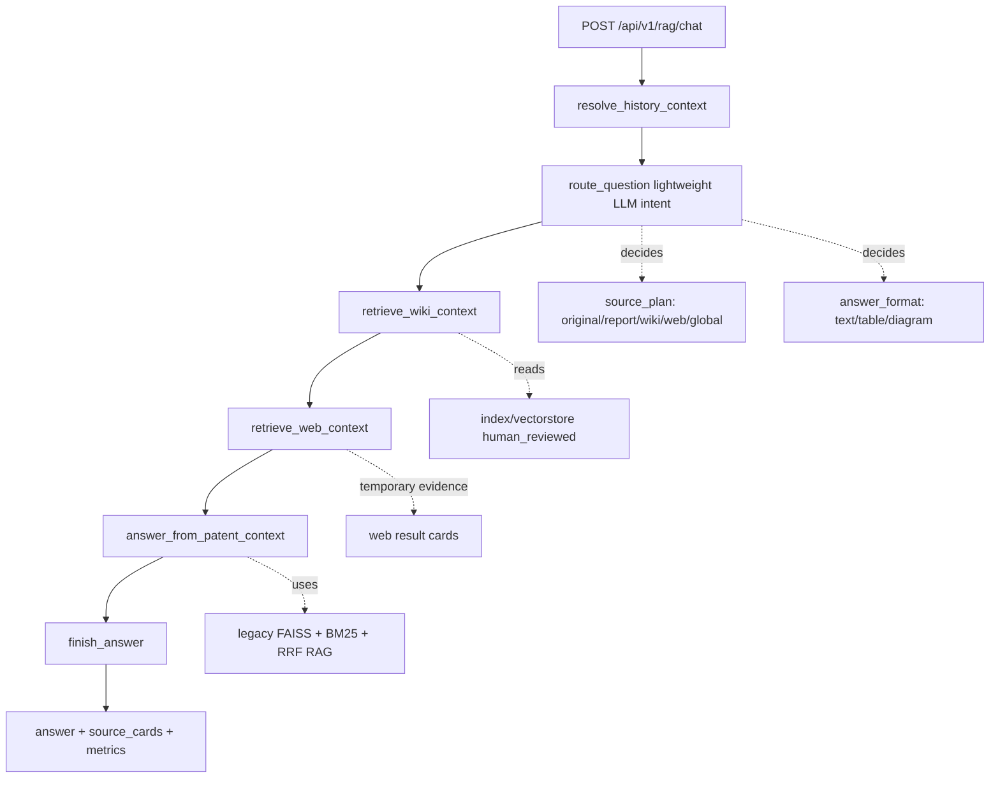

# SKIPA AI Server

특허 가치평가, 보조 자료 수집, 유사 특허 분석, 유지/포기 의사결정 보조 보고서 생성을 제공하는 FastAPI 기반 AI 백엔드 서버입니다.

현재 핵심 구현은 `eval_logic` 아래에 있으며, LangGraph 스타일의 supervisor workflow로 평가 파이프라인을 실행합니다.

## 주요 기능

- 특허 JSON 입력 기반 가치평가 및 유지/포기 의사결정 보고서 생성
- 특허 PDF 원문 업로드 기반 메타데이터, 청구항, 명세서 핵심 섹션 추출
- 규칙 기반 자동 점수 산출
- LLM 기반 평가 항목 산출
- KOSIS/KSIC/IPC 기반 시장 성장성 보조 평가
- RAG 기반 제품/사업화 현황 추정
- 유사 특허 분석 결과 통합
- 챗봇 RAG용 특허별 원문/보고서/wiki/index 데이터 관리
- `rag.zip` 기준 FAISS + BM25 + RRF + 의도 분류 + 웹 검색 챗봇 RAG 엔진 복구
- LangGraph 기반 챗봇 답변, wiki 감사, 전처리/재색인 workflow
- 감사 자동 적용 후 승인 데이터만 반영하는 안전한 vectorstore refresh
- 공식 출원 자료팩 기반 특허 출원 도우미 챗봇
- Swagger UI를 통한 API 테스트
- API 테스트용 입력/출력 산출물 분리 저장

## 디렉토리 구조

```text
skipa-ai-server/
  README.md
  .gitignore

  data/                   # 챗봇과 보고서 로직이 공유하는 중앙 데이터 루트
    mapped_patent_reports/
      <patent_id>/        # 특허별 원문, 보고서 JSON, 위키, chunk/index 관리
        original/
          pdf/
          input/
        reports/
          json/
        wiki/
        extracted/
        index/
    api_test/             # Swagger/API 테스트용 입력·출력 저장소
      input/
        pdf/
        extracted/
        uploads/
      output/
        reports/
    artifacts/            # 로컬 생성 산출물/cache/report
    business_rag/         # 제품/사업화 RAG 데이터
    patent_application_official_pack(1)/
      downloads/          # 공식 출원 자료 다운로드/크롤링 결과
      download_report.md  # 다운로드 불가 URL 리포트
      *.md, *.csv, *.json # 출원 절차/거절대응/선행기술 공식 자료팩

  eval_logic/
    requirements.txt
    .env                  # 로컬 환경변수 파일, git에 올리면 안 됨

    src/
      api/                # FastAPI 엔드포인트, API 요청/응답 스키마, 인메모리 Job 저장소
      agent/              # supervisor 기반 특허 의사결정 workflow, 보고서 조립
      services/           # 가치평가 서비스, 증거/자료 수집 서비스
      core/               # 공통 경로, 표준 input/output schema, normalizer
      evaluation/         # 자동 점수, LLM 평가, KOSIS 성장률, 웹 검색
      document_processing/ # 특허 PDF 원문 파싱
      business_rag/       # 제품/사업화 현황 RAG
      patent_analysis/    # 유사 특허 분석
      cli/                # 로컬 실행/그래프 시각화 CLI

    samples/
      input/              # 테스트용 샘플 특허 JSON
      data/               # 샘플 보조 데이터
      patent_documents/   # Swagger/API 테스트용 샘플 PDF

    resources/            # 매핑표, RAG 리소스
    legacy/               # 현재 API와 직접 무관한 프로토타입/레거시 코드

  chatbot/
    .env.example          # 챗봇 실행 환경변수 예시
    requirements.txt      # 챗봇 Swagger API 실행 의존성
    app/
      main.py             # 챗봇 FastAPI entrypoint
      config.py           # DATA_ROOT, PATENTS_ROOT 등 경로/환경변수 처리
      application_data.py # 특허 출원 공식팩 다운로드, 인덱싱, 검색 helper
      store.py            # 중앙 data 폴더 read/search helper
      schemas.py          # Swagger request/response schema
      routers/
        chatbot.py        # 챗봇, rag, agent, wiki API router
      legacy/             # rag.zip에서 복구한 전처리/RAG 엔진
        ingest.py         # PDF/HTML/JSON chunk, visual asset 추출
        rag_pipeline.py   # FAISS + BM25 + RRF + intent/web 답변 엔진
      rag/
        legacy_adapter.py # 현재 중앙 data 구조와 legacy 엔진 연결
      agents/
        graph.py          # 챗봇 LangGraph 답변 workflow
        application_graph.py # 특허 출원 도우미 LangGraph workflow
        ingestion_graph.py # 전처리/FAISS 재색인 LangGraph workflow
        wiki_graph.py     # 감사/사람검토/vectorstore 갱신 workflow
      static/             # /ui, /chat 브라우저 테스트 화면
    data/
      mapped_patent_reports -> ../../data/mapped_patent_reports
      business -> ../../data/business
    wiki_auditor/         # 기존 wiki 감사 fixture
    logs/                 # 로컬 실행 로그, git 제외
      wiki_auditor/       # 새 감사 실행 결과, git 제외
    patents_backup_*/     # 이전 특허 데이터 backup, git 제외
```

## 전체 아키텍처

전체 시스템은 `data/`를 중심에 두고, 보고서 생성 로직과 챗봇 RAG가 같은 특허별
폴더를 바라보는 구조입니다.

```text
사용자 / Swagger / CLI
        |
        v
eval_logic FastAPI
  - PDF 업로드
  - JSON 업로드
  - tool API
  - 보고서 생성 API
        |
        v
전처리 / 정규화
  - PDF 원문 파싱
  - normalize_patent_input()
  - 표준 특허 input JSON 생성
        |
        v
PatentDecisionWorkflow
  - collect_evidence
  - validate_input
  - run_valuation
  - analyze_similar_patents
  - make_decision
  - build_report
        |
        v
data/
  - api_test/                         Swagger/API 재현용 입출력
  - mapped_patent_reports/<patent_id> 특허별 원문, 보고서, 위키, index
        ^
        |
chatbot
  - 특허별 원문 chunk
  - 보고서 chunk
  - wiki/vectorstore
  - FAISS index 기반 질의 응답
```

역할 분리는 다음과 같습니다.

```text
eval_logic
  PDF/JSON 입력을 받아 평가 workflow를 실행하고 보고서 JSON을 생성합니다.

chatbot
  특허별 원문, 보고서, wiki, vector index를 읽어 질의 응답에 사용합니다.

data
  두 시스템이 공유하는 단일 데이터 루트입니다. 특허 하나는
  data/mapped_patent_reports/<patent_id> 하나의 폴더에서 관리합니다.
```

기존 경로와의 호환성을 위해 `chatbot/data/mapped_patent_reports`,
`chatbot/data/business`, `eval_logic/api_test`는 중앙 `data/` 아래의 실제 폴더를
가리키도록 연결되어 있습니다.

## Chatbot 디렉토리

`chatbot`은 보고서 생성 결과와 특허 원문 데이터를 RAG로 검색해 사용자의 질문에
답하는 영역입니다. 이 repository에서 커밋으로 관리되는 핵심은 실행 환경 예시,
중앙 데이터 폴더 연결, wiki 감사 결과입니다.

```text
chatbot/
  .env.example
    DATA_ROOT, PATENTS_ROOT, embedding model, LLM model, web search, API key
    변수 예시를 제공합니다. 실제 키는 chatbot/.env에만 둡니다.

  data/mapped_patent_reports
    ../../data/mapped_patent_reports를 가리키는 연결입니다.
    챗봇은 여기서 특허별 original, reports, wiki, extracted, index를 읽습니다.

  data/business
    ../../data/business를 가리키는 연결입니다.
    제품/사업화 RAG에 필요한 공통 business index를 읽습니다.

  wiki_auditor/
    기존 wiki 감사 fixture입니다. Swagger에서 새 감사를 실행하면 기본적으로
    chatbot/logs/wiki_auditor 아래에 새 감사 리포트와 audit.log가 저장됩니다.
```

현재 `chatbot/app`에는 Swagger에서 챗봇 API를 확인할 수 있는 FastAPI 앱이
포함되어 있습니다.

```text
app/main.py
  챗봇 API 서버 entrypoint입니다. /docs, /openapi.json, /health를 제공합니다.

app/config.py
  chatbot/.env, DATA_ROOT, PATENTS_ROOT, PUBLIC_FILE_BASE_URL, embedding/model 설정을 읽습니다.

app/store.py
  data/mapped_patent_reports, data/business, wiki 감사 파일을 읽고
  특허 목록, manifest, latest input/report, chunk, 간단 검색 결과를 반환합니다.

app/schemas.py
  Swagger에서 보이는 query/search request와 response schema를 정의합니다.

app/routers/chatbot.py
  /api/v1/chatbot, /api/v1/rag, /api/v1/agent, /api/v1/wiki API를 제공합니다.
```

현재 챗봇 Swagger API는 중앙 데이터 연결 확인, RAG 검색, 실제 답변 생성,
전처리/FAISS 재색인, wiki 감사와 사람 승인 vectorstore 갱신까지 확인할 수 있습니다.
`rag.zip`의 원래 RAG 성능을 유지하기 위해 `chatbot/app/legacy`에 복구한 엔진을
우선 사용하고, 현재 프로젝트에서 발전한 중앙 `data/`, 감사, UI, LangGraph 구조는
그대로 유지합니다.

Swagger에서 확인 가능한 챗봇 API:

```text
GET  /health
GET  /api/v1/chatbot/config
GET  /api/v1/chatbot/data-links
GET  /api/v1/chatbot/patents
GET  /api/v1/chatbot/patents/{patent_id}
GET  /api/v1/chatbot/patents/{patent_id}/files
GET  /api/v1/chatbot/patents/{patent_id}/input/latest
GET  /api/v1/chatbot/patents/{patent_id}/report/latest
GET  /api/v1/chatbot/patents/{patent_id}/chunks
GET  /api/v1/chatbot/business/chunks
GET  /api/v1/chatbot/vectorstore/status
GET  /api/v1/chatbot/preprocess/status
POST /api/v1/chatbot/preprocess/run
POST /api/v1/chatbot/vectorstore/refresh
POST /api/v1/chatbot/search
POST /api/v1/chatbot/query
POST /api/v1/chatbot/answer
POST /api/v1/rag/query
POST /api/v1/rag/answer
GET  /api/v1/rag/engine/status
GET  /api/v1/rag/patents
GET  /api/v1/rag/patent-summary-cards
POST /api/v1/rag/chat
POST /api/v1/rag/global/chat
POST /api/v1/rag/reindex
POST /api/v1/rag/global/reindex
POST /api/v1/rag/business/reindex
GET  /api/v1/rag/ingestion/mermaid
GET  /api/v1/rag/chat/mermaid
GET  /api/v1/rag/page-image
POST /api/v1/rag/feedback
POST /api/v1/agent/query
POST /api/v1/agent/answer
GET  /api/v1/chatbot/wiki-audit/report
POST /api/v1/chatbot/wiki-audit/run
GET  /api/v1/chatbot/wiki-audit/review
POST /api/v1/chatbot/wiki-audit/apply
GET  /api/v1/wiki/audit-report
POST /api/v1/wiki/audit
GET  /api/v1/wiki/audit-review
POST /api/v1/wiki/audit-apply
POST /api/v1/wiki/audit-auto-refresh
POST /api/v1/wiki/agent/run
GET  /api/v1/wiki/agent/mermaid
GET  /api/v1/application/status
GET  /api/v1/application/external/status
POST /api/v1/application/preprocess
POST /api/v1/application/sources/download
GET  /api/v1/application/sources/download-report
POST /api/v1/application/index/refresh
POST /api/v1/application/chat
GET  /api/v1/application/chat/mermaid
```

전처리와 vectorstore refresh는 Swagger와 CLI 둘 다에서 실행할 수 있습니다.

```bash
# 승인 wiki 정규화 + 원본/보고서 core vectorstore + 특허별 wiki vectorstore 갱신
scripts/preprocess_chatbot_data.sh --mode refresh

# 감사 후 주의/나쁜 데이터 자동 제외 + 승인본 refresh
scripts/preprocess_chatbot_data.sh --mode auto-audit

# 출원 공식팩 전처리 리포트 생성 + 출원 도우미 vectorstore 갱신
scripts/preprocess_chatbot_data.sh --mode application-preprocess

# 챗봇 core/wiki refresh와 출원팩 전처리를 함께 실행
scripts/preprocess_chatbot_data.sh --mode all
```

`POST /api/v1/wiki/audit` 또는 `POST /api/v1/chatbot/wiki-audit/run`을 실행하면
전체 `data/mapped_patent_reports`와 `data/business`를 다시 스캔하고, 나쁜 데이터
후보를 `review.md`로 만듭니다. 사람이 Swagger에서 후보를 확인한 뒤
`POST /api/v1/wiki/audit-apply`를 실행하면 선택된 후보만 제외한
`approved_context.md`가 특허별 `wiki/` 폴더와 `reviewed/` 승인 문서에 저장되고,
그 승인본 기준으로 vectorstore가 갱신됩니다. 생성 파일은 Git 커밋 대상에서 제외됩니다.

자동 refresh가 필요할 때는 `POST /api/v1/wiki/audit-auto-refresh` 또는
`POST /api/v1/chatbot/vectorstore/refresh?auto_audit=true`를 사용합니다. 이 모드는
`exclude` 후보와 `medium` 이상 `review` 후보를 주의/나쁜 데이터로 보고 자동 제외한 뒤
승인본만 vectorstore에 반영합니다. 특허별 wiki vectorstore에는
`data/mapped_patent_reports/<patent_id>/wiki/approved_context.md`만 들어가며,
`web_search_drafts` 같은 승인 전 임시 검색 초안은 제외됩니다. vectorstore 파일은
임시 파일을 완성한 뒤 교체하므로 refresh 중에도 기존 `documents.jsonl`은 계속 읽을 수 있습니다.

### 감사 프로세스와 평가 기준

Wiki 감사, 사람 검토, 승인본 저장, vectorstore 갱신은 `chatbot/app/agents/wiki_graph.py`
의 LangGraph agent로 실행됩니다. `/api/v1/wiki/audit`, `/api/v1/wiki/audit-review`,
`/api/v1/wiki/audit-apply`는 모두 이 graph의 mode별 실행 wrapper입니다.

감사는 원본 chunk, 최신 input JSON, 최신 report JSON, wiki 문서, business chunk를
문서 단위로 스캔합니다. 기본 흐름은 사람 검토 후보를 만들고, 자동 refresh 흐름에서는
주의 이상 후보만 자동 제외합니다.

```text
1. Audit
   원본 데이터를 스캔하고 finding_id가 붙은 나쁜 데이터 후보를 생성합니다.

2. Human Review
   GET /api/v1/wiki/audit-review 또는 review.md에서 후보의 사유와 원문 excerpt를 확인합니다.

3. Apply
   POST /api/v1/wiki/audit-apply로 제외할 finding_id를 확정합니다.
   exclude_finding_ids를 null로 보내면 기본 exclude 후보만 제외합니다.
   빈 배열 []로 보내면 제외 없이 전체를 승인합니다.

4. Auto Refresh
   POST /api/v1/wiki/audit-auto-refresh는 default exclude와 medium/high review 후보를
   자동 제외한 뒤 승인본을 저장합니다.

5. Approved Markdown
   각 특허별 data/mapped_patent_reports/<patent_id>/reviewed/approved_context.md에
   제외된 부분을 뺀 승인본을 저장합니다.

6. Vectorstore Refresh
   approved_context.md와 approved_documents.jsonl 기준으로 vectorstore를 재생성합니다.
```

평가 기준:

```text
EMPTY_OR_TOO_SHORT
  본문이 30자 미만이면 검색 근거로 가치가 낮아 high/exclude 후보로 표시합니다.

OCR_NOISE
  한글/영문/숫자 비율이 낮고 기호가 과도하면 OCR 또는 표 추출 잡음으로 보고 high/exclude 후보로 표시합니다.

ERROR_TEXT
  traceback, exception, undefined, NaN, internal server error 같은 시스템 오류 문자열이 있으면 high/exclude 후보로 표시합니다.

SECRET_PATTERN
  API key, access token, private key 패턴이 보이면 민감정보 위험으로 high/exclude 후보로 표시합니다.

METADATA_MISMATCH
  metadata patent_id와 실제 source path의 특허 폴더가 다르면 다른 특허 데이터가 섞인 것으로 보고 high/exclude 후보로 표시합니다.

DUPLICATE_TEXT
  동일 text hash가 이미 등장하면 중복 chunk로 보고 medium/exclude 후보로 표시합니다.

REPEATED_PATTERN
  같은 문자나 토큰이 과도하게 반복되면 OCR footer, 표 파싱 반복, 깨진 chunk 가능성으로 보고 medium/review 후보로 표시합니다.

MISSING_METADATA
  source_type, source_path 등 출처 추적 정보가 부족하면 low/review 후보로 표시합니다.

OVERSIZED_DOCUMENT
  문서가 너무 길어 vectorstore 저장 시 잘릴 가능성이 있으면 low/review 후보로 표시합니다.
```

Wiki LangGraph agent:



전체 시스템 Mermaid:



## 중앙 데이터 저장 규칙

보고서 생성 로직과 챗봇은 모두 `SKIPA_DATA_ROOT` 또는 `DATA_ROOT`를 먼저 확인하고,
값이 없으면 repository 루트의 `data/`를 기본값으로 사용합니다.

특허별 표준 폴더 구조:

```text
data/mapped_patent_reports/<patent_id>/
  manifest.json
  original/
    pdf/
      latest.pdf
      <timestamp>_<source>.pdf
    input/
      latest.json
      <timestamp>_<kind>_<source>.json
  reports/
    json/
      latest.json
      <timestamp>_<job_id>.json
  wiki/
    approved_context.md
    vectorstore/
      local/
  extracted/
    all_chunks.jsonl
    original_pdf_chunks.jsonl
    report_pdf_chunks.jsonl
    original_visual_chunks.jsonl
    report_visual_chunks.jsonl
    assets/
  index/
    faiss/
```

`manifest.json`에는 특허 ID, 제목, 최신 input, 최신 PDF, 최신 보고서, wiki/index
위치, 저장 이력이 기록됩니다. 발표나 디버깅 때는 이 파일을 보면 해당 특허에 어떤
데이터가 연결되어 있는지 빠르게 확인할 수 있습니다.

이 구조로 통합한 이유:

- 보고서 생성 결과가 곧바로 챗봇 질의 응답 데이터가 됩니다.
- `eval_logic/api_test`와 `chatbot/data`에 흩어져 있던 입출력을 한곳에서 추적합니다.
- 특허별로 원문, 보고서, 승인 wiki, vector index를 같이 보관해 재현성이 좋아집니다.
- `latest.*` 파일을 두어 API나 챗봇이 가장 최근 데이터를 쉽게 찾을 수 있습니다.

## Agent Workflow

현재 workflow는 기능별 review node를 별도로 두지 않고, `supervisor`가 전체 상태를 점검하며 다음 worker node를 결정합니다.

```text
supervisor
 -> collect_evidence
 -> supervisor
 -> validate_input
 -> supervisor
 -> run_valuation
 -> supervisor
 -> analyze_similar_patents
 -> supervisor
 -> make_decision
 -> supervisor
 -> build_report
 -> supervisor
 -> END
```

각 node의 역할은 다음과 같습니다.

```text
collect_evidence
  PDF 메타데이터 추출, 사업화 RAG 등 보조 자료 수집

validate_input
  특허 ID, 제목, 청구항, 설명 요약 등 평가 입력 검증

run_valuation
  시장 성장성, 자동 점수, LLM 평가 실행

analyze_similar_patents
  유사 특허 분석 결과 조회 또는 분석

make_decision
  점수, 시장성, 유사 특허, 사업화 신호를 종합해 유지/포기/검토 권고 생성

build_report
  최종 의사결정 보조 보고서 JSON 생성
```

## 표준 Input Schema

모든 API/서비스 진입점은 `src/core/schemas.py`의 `normalize_patent_input()`을 거쳐 표준 입력 형태로 정규화됩니다.

```json
{
  "schema_version": "patent-input/v1",
  "patent_id": "10-0000000",
  "meta": {
    "title": "특허 제목",
    "registration_number": "10-0000000",
    "registration_date": "2024-01-01",
    "application_number": "10-0000-0000000",
    "application_date": "2022-01-01",
    "publication_number": "10-0000-0000000",
    "publication_date": "2023-01-01",
    "legal_status": "등록",
    "assignee": ["권리자"],
    "inventors": ["발명자"],
    "ipc": ["G06Q10/04"],
    "cpc": ["G06Q10/04"],
    "prior_art_cited": [],
    "total_claims": 10,
    "deleted_claims": []
  },
  "description_summary": "초록 및 명세서 핵심 요약",
  "claims_text": {
    "claim_1": {
      "type": "독립항",
      "category": "방법",
      "text": "청구항 1 내용"
    }
  },
  "specification": {
    "technical_field": "기술분야",
    "background_art": "배경기술",
    "problem_to_solve": "해결하려는 과제",
    "solution": "과제의 해결 수단",
    "advantageous_effects": "발명의 효과",
    "implementation": "구체적인 실시 내용"
  },
  "legal": {},
  "source_pdf": "업로드 PDF 경로"
}
```

허용되는 입력 형태:

```text
표준 특허 JSON
{"patent": {...}}
{"patent_data": {...}}
{"normalized_patent": {...}}
PDF 추출 결과 JSON
```

## 챗봇 전처리 방식

챗봇은 보고서 생성 로직이 저장한 특허별 폴더를 그대로 사용합니다. 전처리 결과는
`data/mapped_patent_reports/<patent_id>/extracted`, `index`, `wiki` 아래에
저장됩니다.

현재 전처리는 `rag.zip`에서 복구한 `chatbot/app/legacy/ingest.py`와
`chatbot/app/legacy/rag_pipeline.py`를 LangGraph 전처리 agent로 감싼 구조입니다.
예전 zip은 `meta.json`과 `original.pdf` 같은 flat layout을 기대했지만, 현재 코드는
`manifest.json`, `original/pdf/latest.pdf`, `reports/json/latest.json`을 읽는
compat layer를 추가해 중앙 데이터 구조를 그대로 사용합니다.

전처리 대상:

```text
특허 원문 PDF
  명세서, 청구항, 도면/이미지, 페이지 단위 텍스트

보고서 PDF 또는 보고서 JSON
  평가 항목, 표, 유지/포기 판단 근거, 점수, 코멘트

wiki 데이터
  특허별 배경 지식, 용어 설명, 외부/내부 정리 문서
```

전처리 산출물:

```text
extracted/all_chunks.jsonl
  원문, 보고서, 시각 자료 chunk를 통합한 검색 단위

extracted/original_pdf_chunks.jsonl
  특허 원문 텍스트 chunk

extracted/report_pdf_chunks.jsonl
  보고서 텍스트 chunk

extracted/original_visual_chunks.jsonl
extracted/report_visual_chunks.jsonl
  도면, 이미지, 표 같은 시각 자료 chunk

extracted/assets/
  PDF에서 추출한 이미지, 표 HTML/PNG, thumbnail

index/faiss/
  특허별 RAG 검색용 FAISS index

wiki/vectorstore/faiss/
  특허별 wiki 검색용 FAISS index
```

이 방식으로 전처리한 이유:

- 원문과 보고서의 출처를 chunk metadata로 유지해 답변 근거를 추적할 수 있습니다.
- 긴 PDF를 한 번에 LLM에 넣지 않고 검색 가능한 작은 단위로 쪼개 응답 품질을 높입니다.
- 표, 도면, 페이지 이미지 같은 시각 자료도 별도 asset으로 남겨 챗봇이 근거 자료를 연결할 수 있습니다.
- 특허별 index를 분리해 다른 특허의 내용이 섞이는 문제를 줄입니다.
- `_global` index를 같이 두어 전체 특허를 대상으로 한 검색도 확장할 수 있습니다.

보고서 생성 API가 새 input/output을 만들면 `patent_data_store.py`가 같은 특허 폴더의
`original/input`과 `reports/json`에 최신 파일을 저장합니다. 이후 챗봇 전처리 또는
index 재생성 단계에서 이 파일들을 읽으면 새 보고서가 RAG에 반영됩니다.

전처리/재색인 LangGraph:



## 환경 설정

`skipa-ai-server/eval_logic` 기준으로 실행합니다.

```bash
cd eval_logic
python -m venv .venv
source .venv/bin/activate
pip install -r requirements.txt
```

`.env` 파일은 로컬에서만 생성합니다. 절대 GitHub에 올리면 안 됩니다.

예시:

```env
OPENAI_API_KEY=...
KOSIS_API_KEY=...
KIPRIS_API_KEY=...
KSIC_TABLE_PATH=resources/산업_KSIC_-특허_IPC__연계표.xlsx
```

## 서버 실행

### 보고서 생성 API 서버

`skipa-ai-server/eval_logic`에서 실행합니다.

```bash
PYTHONPATH=src uvicorn api.main:app --reload --host 127.0.0.1 --port 8000
```

Swagger UI:

```text
http://127.0.0.1:8000/docs
```

Health check:

```text
GET /health
```

### 챗봇 Swagger API 서버

`skipa-ai-server/chatbot`에서 실행합니다.

```bash
cd chatbot
python -m venv .venv
source .venv/bin/activate
pip install -r requirements.txt
cp .env.example .env
uvicorn app.main:app --reload --host 127.0.0.1 --port 8001
```

Swagger UI:

```text
http://127.0.0.1:8001/docs
```

브라우저 테스트 UI:

```text
http://127.0.0.1:8001/ui
```

테스트 UI는 채팅 중심 화면입니다. 특허를 선택해 질문하면 답변 요약과 클릭
가능한 근거 카드가 표시되고, 감사 패널에서는 wiki 감사 실행, finding 상세
확인, finding 선택 적용, 승인 Markdown 확인, 워크플로우 확인을 한 화면에서
테스트할 수 있습니다.

챗봇 Swagger에서 바로 눌러볼 대표 API:

```text
GET  /health
GET  /api/v1/chatbot/config
GET  /api/v1/chatbot/patents
GET  /api/v1/chatbot/patents/10-2886381
GET  /api/v1/chatbot/patents/10-2886381/chunks
GET  /api/v1/chatbot/vectorstore/status
POST /api/v1/wiki/audit
GET  /api/v1/wiki/audit-review
POST /api/v1/wiki/audit-apply
POST /api/v1/wiki/agent/run
GET  /api/v1/wiki/agent/mermaid
POST /api/v1/chatbot/answer
POST /api/v1/chatbot/query
POST /api/v1/rag/answer
POST /api/v1/rag/query
GET  /api/v1/wiki/audit-report
```

질의 API 예시:

```json
{
  "query": "CMP Pad 물류 관리 시스템의 유지 판단 근거",
  "patent_id": "10-2886381",
  "source_types": ["ORIGINAL_PDF", "REPORT_PDF"],
  "top_k": 5
}
```

## API 엔드포인트

### 서비스용 보고서 API

```text
POST /api/v1/reports/patent-maintenance/from-json
POST /api/v1/reports/patent-maintenance/from-json-file
POST /api/v1/reports/patent-maintenance/from-pdf
GET  /api/v1/reports/{job_id}
GET  /api/v1/reports/{job_id}/status
GET  /api/v1/reports/{job_id}/result
```

`from-json`은 request body로 특허 JSON을 받습니다.

```json
{
  "patent": {
    "patent_id": "10-0000000",
    "meta": {
      "title": "특허 제목",
      "registration_number": "10-0000000",
      "ipc": ["G06Q10/04"]
    },
    "claims_text": {
      "claim_1": {
        "type": "독립항",
        "category": "방법",
        "text": "청구항 내용"
      }
    },
    "description_summary": "발명의 요약"
  }
}
```

`from-json-file`은 Swagger에서 JSON 파일을 업로드합니다. `samples/input/*.json` 또는 `data/api_test/input/extracted/*.json` 파일을 그대로 사용할 수 있습니다.

`from-pdf`는 Swagger에서 특허 PDF 파일을 업로드합니다. PDF에서 input JSON을 추출한 뒤 보고서 workflow까지 실행합니다.

### 개발/디버그용 통합 API

```text
POST /api/v1/dev/patent-decision/evaluate
POST /api/v1/dev/patent-decision/evaluate-sample/{sample_name}
```

`evaluate`는 옵션을 직접 제어하며 전체 workflow를 실행합니다.

```json
{
  "patent_data": {
    "patent_id": "10-0000000",
    "meta": {
      "title": "특허 제목",
      "registration_number": "10-0000000"
    },
    "claims_text": {
      "claim_1": {
        "type": "독립항",
        "text": "청구항 내용"
      }
    },
    "description_summary": "발명의 요약"
  },
  "options": {
    "enable_market": true,
    "enable_auto": true,
    "enable_llm": true,
    "enable_pdf_metadata_extraction": false,
    "enable_business_rag": true,
    "enable_similar_analysis": true,
    "similar_use_llm": true,
    "rag_top_k": 5,
    "fail_on_validation_error": true,
    "enable_human_review": false
  }
}
```

샘플 파일 실행:

```text
POST /api/v1/dev/patent-decision/evaluate-sample/patent_10_1306409
```

### 기능별 Tool API

```text
POST /api/v1/tools/patent-metadata
POST /api/v1/tools/business-rag
POST /api/v1/tools/market-growth
POST /api/v1/tools/auto-score
POST /api/v1/tools/llm-evaluation
POST /api/v1/tools/similar-patents
```

`patent-metadata`는 Swagger에서 PDF 파일을 직접 업로드합니다.

결과:

```text
data/api_test/input/pdf/        업로드된 PDF
data/api_test/input/extracted/  PDF에서 추출된 표준 input JSON
data/mapped_patent_reports/<patent_id>/original/pdf/
data/mapped_patent_reports/<patent_id>/original/input/
```

나머지 tool API는 대체로 다음 형태를 사용합니다.

```json
{
  "patent": {
    "patent_id": "10-0000000",
    "meta": {
      "title": "특허 제목",
      "registration_number": "10-0000000",
      "ipc": ["G06Q10/04"]
    },
    "claims_text": {
      "claim_1": {
        "type": "독립항",
        "text": "청구항 내용"
      }
    },
    "description_summary": "발명의 요약"
  }
}
```

## 통합 워크플로우

### PDF에서 보고서와 챗봇 데이터까지

```text
1. 사용자가 Swagger에서 특허 PDF 업로드
2. eval_logic이 PDF를 data/api_test/input/pdf/에 저장
3. document_processing이 PDF에서 특허번호, 제목, 청구항, 명세서 섹션 추출
4. normalize_patent_input()이 표준 input JSON으로 정규화
5. 추출 JSON을 data/api_test/input/extracted/에 저장
6. 같은 input을 data/mapped_patent_reports/<patent_id>/original/input/에 저장
7. 원본 PDF를 data/mapped_patent_reports/<patent_id>/original/pdf/에 저장
8. PatentDecisionWorkflow가 평가와 의사결정 보고서 생성
9. 보고서 JSON을 data/api_test/output/reports/에 저장
10. 같은 보고서를 data/mapped_patent_reports/<patent_id>/reports/json/에 저장
11. 챗봇은 해당 특허 폴더의 original, reports, wiki, index 데이터를 사용
```

### JSON에서 보고서 생성

```text
1. 사용자가 표준 특허 JSON 또는 PDF 추출 JSON 업로드
2. normalize_patent_input()으로 입력 형태 통일
3. data/api_test/input/uploads/에 업로드 원본 저장
4. data/mapped_patent_reports/<patent_id>/original/input/에 특허별 input 저장
5. workflow 실행 후 보고서 생성
6. data/api_test/output/reports/와 특허별 reports/json/에 결과 저장
```

### 챗봇 조회 흐름

```text
1. 사용자가 특정 특허 또는 전체 특허에 대해 질문
2. ChatGraph가 chat_history와 context_patent_id로 이어지는 질문인지 판단
3. lightweight LLM intent agent가 질문 의도, source_plan, 답변 형식, 웹검색 필요 여부를 분류
4. 감사 승인본 기반 특허별 wiki vectorstore에서 보조 context를 먼저 검색
5. wiki에 충분한 근거가 없고 의도 라우터가 외부 정보가 필요하다고 판단하면 웹 검색 실행
6. rag.zip에서 복구한 FAISS + BM25 + RRF RAG 엔진과 LangGraph 답변 agent가 원문/보고서/core 근거와 wiki/web 보강 근거로 답변 생성
7. 질문이 표/다이어그램을 요구하면 Markdown 표 또는 Mermaid 다이어그램을 포함
8. 답변, source_cards, agent_trace, confidence/latency/answer_mode metrics를 반환
```

챗봇 LangGraph:



특허 출원 도우미 LangGraph:

```mermaid
flowchart TD
  A[POST /api/v1/application/chat] --> H[resolve_application_history]
  H --> I[route_application_question lightweight LLM intent]
  I --> R[retrieve_application_context]
  R --> X{external evidence needed?}
  X -->|yes| E[retrieve_application_external_context]
  X -->|no| S[skip external search]
  E --> G[answer_application_question]
  S --> G
  G --> F[finish_application_answer]
  F --> O[answer + source_cards + quality metrics]

  D[data/patent_application_official_pack(1)] --> IX[index/vectorstore]
  DL[POST /api/v1/application/sources/download] --> D
  PP[POST /api/v1/application/preprocess] --> IX
  RF[POST /api/v1/application/index/refresh] --> IX
  R -. searches .-> IX
  I -. routes .-> P[procedure/forms/claims/prior-art/rejection/fees/strategy]
  E -. uses .-> EXT[KIPRIS/KOSIS/Tavily status + web evidence]
```

출원 도우미는 기존 특허별 가치평가 챗봇과 분리된 라우팅을 사용합니다. 질문이
거절이유 대응이면 의견제출통지서/보정/심판 근거를 우선하고, 선행기술 질문이면
KIPRIS/CPC/IPC 검색 자료를 우선하며, 처음 출원 절차 질문이면 특허로 출원가이드와
절차 체크리스트를 우선 검색합니다. 다운로드 또는 크롤링에 실패한 URL은
`data/patent_application_official_pack(1)/download_report.md`에 남습니다.
실패 요인 분석/거절 대응/사업화/최신 동향처럼 내부 공식팩만으로 부족한 질문은
`KIPRIS_API_KEY`, `KOSIS_API_KEY`, `TAVILY_API_KEY` 설정 상태를 metrics에 표시하고,
사용 가능한 외부 근거를 답변의 근거 카드에 함께 붙입니다.

답변 품질은 `metrics.answer_quality`에 표시됩니다. 항상 계산되는 지표는 검색 근거와
답변의 의미 유사도, 질문 키워드가 답변/근거에 반영된 비율, retrieval 평균 점수이며,
`bert-score` 패키지와 모델이 준비된 환경에서는 BERTScore precision/recall/f1도 함께
계산됩니다.

## API 테스트 흐름

### JSON 파일 기반 보고서 생성

1. 서버 실행
2. Swagger 접속
3. `POST /api/v1/reports/patent-maintenance/from-json-file`
4. `samples/input/*.json` 또는 `data/api_test/input/extracted/*.json` 선택
5. 응답의 `job_id`, `status_url`, `result_url` 확인
6. `GET /api/v1/reports/{job_id}/result` 호출

### PDF 기반 input JSON 추출

1. `POST /api/v1/tools/patent-metadata`
2. PDF 파일 업로드
3. 응답의 `normalized_patent`, `extracted_input_path` 확인
4. 생성된 JSON은 `data/api_test/input/extracted/`와 `data/mapped_patent_reports/<patent_id>/original/input/` 아래 저장됨

### PDF 기반 보고서 생성

1. `POST /api/v1/reports/patent-maintenance/from-pdf`
2. PDF 파일 업로드
3. 응답의 `input_path`, `output_path`, `result_url` 확인
4. 생성된 보고서 결과는 `data/api_test/output/reports/`와 `data/mapped_patent_reports/<patent_id>/reports/json/` 아래 저장됨

### 챗봇 UI 및 Swagger API 테스트

1. `cd chatbot`
2. `uvicorn app.main:app --reload --host 127.0.0.1 --port 8001`
3. `http://127.0.0.1:8001/ui` 접속
4. `GET /api/v1/chatbot/config`로 `DATA_ROOT`, `PATENTS_ROOT` 연결 확인
5. `GET /api/v1/chatbot/patents`로 특허 목록 확인
6. `GET /api/v1/chatbot/patents/{patent_id}/chunks`로 원문/보고서 chunk 확인
7. `POST /api/v1/wiki/audit`로 나쁜 데이터 후보 감사 실행
8. `GET /api/v1/wiki/audit-review`로 사람이 제외 후보와 근거 excerpt 확인
9. `POST /api/v1/wiki/audit-apply`로 제외할 후보를 확정하고 승인 Markdown 저장
10. `POST /api/v1/chatbot/preprocess/run`에서 `mode=refresh_vectorstore`로 승인 vectorstore 갱신
11. `GET /api/v1/chatbot/vectorstore/status`로 core/wiki 문서 수 확인
12. `POST /api/v1/rag/chat`으로 질문 답변, 근거 카드, 품질 지표 확인

출원 도우미 테스트:

1. `POST /api/v1/application/preprocess`로 공식팩 전처리와 index refresh 실행
2. `GET /api/v1/application/status`로 `document_count`, `source_roles` 확인
3. `GET /api/v1/application/external/status`로 KIPRIS/KOSIS/Tavily 연결 상태 확인
4. `POST /api/v1/application/chat`으로 출원 절차, 실패 요인, 선행기술, 거절 대응 질문 확인
11. `POST /api/v1/chatbot/answer` 또는 `POST /api/v1/rag/answer`로 답변과 근거 카드 확인
12. `POST /api/v1/chatbot/query` 또는 `POST /api/v1/rag/query`로 원본 검색 hit 확인

같은 기능은 Swagger에서도 `http://127.0.0.1:8001/docs`로 확인할 수 있습니다.

현재 answer/query API는 사람 검토 후 재생성된 로컬 vectorstore를 먼저
검색하고, vectorstore가 없으면 기존 chunk keyword search로 fallback합니다.
`answer`는 검색 결과를 발표/테스트용 답변 요약과 클릭 가능한 근거 카드로
가공해서 반환합니다. 운영형 LLM 답변 생성은 같은 endpoint 뒤에 FAISS retrieval과
LLM generation을 붙여 확장할 수 있습니다.

## 기능별 검증 방법

### GitHub 반영 확인

```bash
cd /Users/kgw/skipers-ai
git log -1 --oneline --decorate
git status --short
```

정상 기준:

```text
HEAD와 origin/<current-branch>가 같은 커밋을 가리킴
git status --short 출력이 비어 있음
```

### 공통 데이터 폴더 확인

```bash
cd /Users/kgw/skipers-ai
ls data
find data/mapped_patent_reports -maxdepth 2 -name manifest.json
```

정상 기준:

```text
data/api_test
data/mapped_patent_reports
data/business
특허별 manifest.json
```

### 챗봇 데이터 연결 확인

```bash
cd /Users/kgw/skipers-ai
readlink chatbot/data/mapped_patent_reports
readlink chatbot/data/business
find data/mapped_patent_reports -path '*index/faiss/*' -type f
find data/mapped_patent_reports -path '*wiki/vectorstore/faiss/*' -type f
find chatbot/app -name '*.py' -type f
```

정상 기준:

```text
chatbot/data/mapped_patent_reports -> ../../data/mapped_patent_reports
chatbot/data/business -> ../../data/business
FAISS index.faiss, index.pkl 파일 존재
chatbot/app 아래 Python source 파일 존재
```

### Python import와 문법 확인

```bash
cd /Users/kgw/skipers-ai
python3 -m compileall eval_logic/src
python3 -m compileall chatbot/app
```

정상 기준:

```text
compile error 없이 종료
```

### PDF 추출 API 확인

서버 실행:

```bash
cd /Users/kgw/skipers-ai/eval_logic
PYTHONPATH=src uvicorn api.main:app --reload --host 127.0.0.1 --port 8000
```

Swagger에서 실행:

```text
POST /api/v1/tools/patent-metadata
파일 예시: ../data/api_test/input/pdf/20260529_144101_pdf.pdf
```

정상 기준:

```text
응답에 normalized_patent, extracted_input_path 포함
data/api_test/input/extracted/에 JSON 생성
data/mapped_patent_reports/<patent_id>/original/pdf/latest.pdf 생성
data/mapped_patent_reports/<patent_id>/original/input/latest.json 생성
```

### JSON 보고서 생성 API 확인

Swagger에서 실행:

```text
POST /api/v1/reports/patent-maintenance/from-json-file
파일 예시: ../data/api_test/input/extracted/20260529_144106_10-1959619_20260529_144101_pdf.json
GET /api/v1/reports/{job_id}/result
```

정상 기준:

```text
status가 success
data/api_test/output/reports/에 보고서 JSON 생성
data/mapped_patent_reports/<patent_id>/reports/json/latest.json 생성
응답 artifacts에 patent_data_dir, patent_report_output_path 포함
```

### PDF 기반 보고서 생성 API 확인

Swagger에서 실행:

```text
POST /api/v1/reports/patent-maintenance/from-pdf
파일 예시: ../data/api_test/input/pdf/20260529_144101_pdf.pdf
GET /api/v1/reports/{job_id}/result
```

정상 기준:

```text
PDF 추출 JSON과 보고서 JSON이 모두 생성됨
특허별 original/pdf, original/input, reports/json이 모두 갱신됨
```

### CLI workflow 확인

```bash
cd /Users/kgw/skipers-ai/eval_logic
python3 src/cli/run_agent.py samples/input/patent_10_1306409.json
```

정상 기준:

```text
Workflow: langgraph
Status: success
결과 저장 경로 출력
```

### 챗봇 Swagger API 확인

서버 실행:

```bash
cd /Users/kgw/skipers-ai/chatbot
pip install -r requirements.txt
test -f .env || cp .env.example .env
uvicorn app.main:app --reload --host 127.0.0.1 --port 8001
```

Swagger 접속:

```text
http://127.0.0.1:8001/docs
```

브라우저 테스트 UI:

```text
http://127.0.0.1:8001/ui
```

Swagger에서 확인할 API:

```text
GET  /health
GET  /api/v1/chatbot/config
GET  /api/v1/chatbot/data-links
GET  /api/v1/chatbot/patents
GET  /api/v1/chatbot/patents/10-2886381
GET  /api/v1/chatbot/patents/10-2886381/chunks
GET  /api/v1/chatbot/vectorstore/status
POST /api/v1/wiki/audit
GET  /api/v1/wiki/audit-review
POST /api/v1/wiki/audit-apply
POST /api/v1/wiki/agent/run
GET  /api/v1/wiki/agent/mermaid
POST /api/v1/chatbot/answer
POST /api/v1/chatbot/query
POST /api/v1/rag/answer
POST /api/v1/rag/query
POST /api/v1/agent/answer
POST /api/v1/agent/query
GET  /api/v1/wiki/audit-report
```

`POST /api/v1/chatbot/answer` request body 예시:

```json
{
  "query": "CMP Pad 물류 관리 시스템의 유지 판단 근거",
  "patent_id": "10-2886381",
  "source_types": ["ORIGINAL_PDF", "REPORT_PDF"],
  "top_k": 5
}
```

확인할 환경변수:

```text
DATA_ROOT=../data
PATENTS_ROOT=../data/mapped_patent_reports
PATENT_APPLICATION_ROOT=../data/patent_application_official_pack(1)
PUBLIC_FILE_BASE_URL=http://localhost:8000/files
EMBEDDING_MODEL=BAAI/bge-m3
TOP_K=10
```

정상 기준:

```text
GET /api/v1/chatbot/patents에서 특허 목록 반환
GET /api/v1/chatbot/patents/10-2886381/chunks에서 chunk 반환
POST /api/v1/wiki/audit에서 status가 human_review_required 또는 clean
GET /api/v1/wiki/audit-review에서 review Markdown과 finding_id 확인
POST /api/v1/wiki/audit-apply에서 approved_context.md 저장 및 vectorstore_refresh.status가 refreshed
POST /api/v1/wiki/audit-auto-refresh에서 status가 auto_applied
GET /api/v1/chatbot/vectorstore/status에서 human_reviewed_source와 document_count 확인
POST /api/v1/chatbot/query에서 local_vectorstore_search hit 반환
GET /api/v1/wiki/audit-report에서 wiki 감사 리포트 반환
GET /api/v1/application/status에서 patent_application index 상태 반환
POST /api/v1/application/chat에서 공식 출원 자료 근거 카드 포함 답변 반환
```

## 로컬 CLI

샘플 JSON workflow 실행:

```bash
cd eval_logic
python src/cli/run_agent.py samples/input/patent_10_1306409.json
```

LangGraph 시각화:

```bash
python src/cli/visualize_agent_graph.py --skip-png
```

## Git 관리 주의사항

다음 파일/디렉토리는 GitHub에 올리지 않습니다.

```text
eval_logic/.env
eval_logic/.env.*
data/artifacts/
data/business_rag/index/
data/business_rag/raw/
data/business_rag/processed/
```

특히 `.env`에는 API 키가 들어가므로 절대 커밋하면 안 됩니다.

`data/api_test`와 `eval_logic/samples/patent_documents`는 다른 사람이 Swagger/API
테스트를 바로 재현할 수 있도록 커밋 대상에 포함합니다. 다만 실제 기업 내부 PDF,
API 키, 비공개 원문, 고객명 등 민감정보가 포함된 JSON/PDF는 넣지 말고 공개 가능한
테스트 fixture만 유지합니다.

커밋 전 확인:

```bash
git status --short
git check-ignore -v eval_logic/.env
```

## 현재 Legacy 영역

현재 API와 직접 무관한 프로토타입/실험용 코드는 `eval_logic/legacy` 아래에 보관합니다.

```text
eval_logic/legacy/src/crawling
eval_logic/legacy/src/reporting
eval_logic/legacy/src/agent/patent_valuation_agent.py
eval_logic/legacy/src/cli/run_pipeline.py
```

신규 API/서비스 코드는 `legacy`에 의존하지 않도록 관리합니다.
