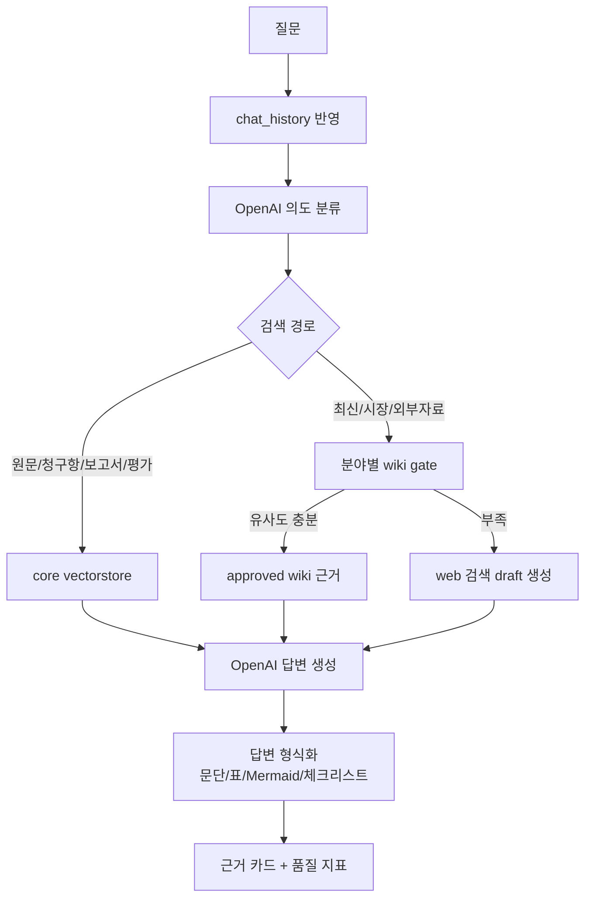
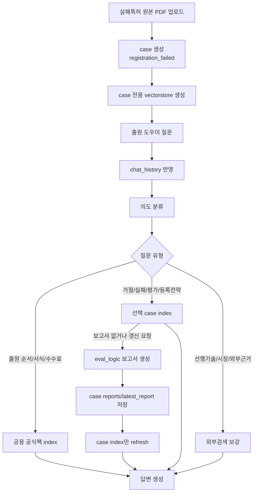

# SKIPA Chatbot

`chatbot`은 특허별 원문/보고서 RAG 챗봇, 특허 출원/실패 원인 분석 도우미, wiki 감사 및 vectorstore 갱신 API/UI를 제공하는 FastAPI 앱입니다.

## 역할

- 특허 챗봇: 특허 원문 PDF, 표준 input JSON, eval_logic 보고서 JSON을 검색해 유지 판단, 리스크, 청구항, 기술 내용, 용어 설명을 답변합니다.
- 출원 도우미: 공식 출원 자료팩과 선택한 실패특허 케이스만 검색해 출원 절차, 거절 대응, 실패 원인, 등록 가능성 개선 방향을 답변합니다.
- 출원 전 사전평가: 출원 예정 아이디어/청구항을 케이스로 만들고 보고서 전용 vectorstore로 보강 방향을 답변합니다.
- wiki gate: 외부정보가 필요한 질문에서 특허가 속한 분야의 승인 wiki를 먼저 검색하고, 부족할 때만 web 검색으로 넘어갑니다.
- 감사 프로세스: web 검색 draft나 wiki 보강 자료 중 나쁜 데이터 후보를 찾고, 승인된 Markdown만 vectorstore에 반영합니다.
- UI 테스트: `/ui`에서 챗봇, 출원 도우미, 감사, workflow Mermaid를 간단히 테스트합니다.

## 실행

### Docker Image

루트에서 Kubernetes 배포용 이미지를 빌드합니다.

```bash
cd /Users/kgw/skipers-ai
docker build -t skipa-ai:latest .
```

챗봇 서버 로컬 검증:

```bash
docker run --rm \
  -p 8001:8001 \
  -e OPENAI_API_KEY="$OPENAI_API_KEY" \
  -e TAVILY_API_KEY="$TAVILY_API_KEY" \
  -v "$PWD/data:/app/data" \
  -v "$PWD/chatbot/data:/app/chatbot/data" \
  -v "$PWD/chatbot/logs:/app/chatbot/logs" \
  -v "$PWD/eval_logic/data:/app/eval_logic/data" \
  skipa-ai:latest chatbot
```

eval_logic 보고서 서버는 같은 이미지에서 `eval-logic` args로 실행합니다.

```bash
docker run --rm \
  -p 8000:8000 \
  -e OPENAI_API_KEY="$OPENAI_API_KEY" \
  -v "$PWD/data:/app/data" \
  -v "$PWD/eval_logic/data:/app/eval_logic/data" \
  -v "$PWD/chatbot/data:/app/chatbot/data" \
  skipa-ai:latest eval-logic
```

Kubernetes CronJob 또는 로컬 수동 재색인은 같은 이미지에서 `nightly-reindex` args로 실행합니다.

```bash
docker run --rm \
  -e OPENAI_API_KEY="$OPENAI_API_KEY" \
  -e TAVILY_API_KEY="$TAVILY_API_KEY" \
  -v "$PWD/data:/app/data" \
  -v "$PWD/chatbot/data:/app/chatbot/data" \
  -v "$PWD/chatbot/logs:/app/chatbot/logs" \
  -v "$PWD/eval_logic/data:/app/eval_logic/data" \
  skipa-ai:latest nightly-reindex
```

접속 주소:

```text
UI      http://127.0.0.1:8001/ui
Swagger http://127.0.0.1:8001/docs
Health  http://127.0.0.1:8001/health
```

Docker 실행 시 `data`, `chatbot/data`, `chatbot/logs`, `eval_logic/data`는 외부 volume으로 mount합니다. Kubernetes에서는 이 경로를 PVC 또는 object storage 동기화 대상으로 잡으면 됩니다.

기본 Docker 이미지는 OpenAI 의도 분류, OpenAI 답변 생성, OpenAI embedding을 사용합니다. Ollama는 포함하지 않습니다. 로컬 HuggingFace embedding과 BERTScore까지 필요하면 `--build-arg INSTALL_LOCAL_EMBEDDINGS=true`로 빌드합니다. 이 옵션은 `torch` 계열 패키지를 포함하므로 이미지가 많이 커집니다.

### 로컬 실행

루트에서 실행합니다.

```bash
cd /Users/kgw/skipers-ai
PYTHONPATH="$PWD" python3 -m uvicorn chatbot.app.main:app --reload --host 127.0.0.1 --port 8001
```

또는 helper script를 사용합니다.

```bash
bash chatbot/scripts/start_chatbot_server.sh
```

접속 주소:

```text
UI      http://127.0.0.1:8001/ui
Swagger http://127.0.0.1:8001/docs
Health  http://127.0.0.1:8001/health
```

## 환경변수

`chatbot/.env.example`을 참고해 `chatbot/.env`를 만듭니다. 실제 API 키는 커밋하지 않습니다.

```env
DATA_ROOT=/Users/kgw/skipers-ai/chatbot/data
SHARED_DATA_ROOT=/Users/kgw/skipers-ai/data
PATENTS_ROOT=/Users/kgw/skipers-ai/chatbot/data/mapped_patent_reports
PATENT_APPLICATION_ROOT=/Users/kgw/skipers-ai/chatbot/data/patent_application_official_pack
WIKI_ROOT=/Users/kgw/skipers-ai/data/wiki
PRE_EVAL_ROOT=/Users/kgw/skipers-ai/data/pre_application_cases

INTENT_PROVIDER=openai
OPENAI_INTENT_MODEL=gpt-4.1-mini

ANSWER_PROVIDER=openai
OPENAI_API_KEY=...
OPENAI_ANSWER_MODEL=gpt-4.1
EMBEDDING_PROVIDER=openai
OPENAI_EMBEDDING_MODEL=text-embedding-3-large

TAVILY_API_KEY=...
ENABLE_WEB_SEARCH=true
```

의도 파악, 답변 생성, embedding은 모두 OpenAI 기준으로 동작합니다. OpenAI 키가 없거나 호출이 실패하면 일부 경로는 규칙 기반 fallback으로 내려갈 수 있습니다.

## 데이터 구조

```text
data/
  <patent_id>/
    patent.pdf
    parsed.json
    report.json
  _vectorstore/
    active_slot.json
    blue/
    green/
  wiki/
    <topic_slug>/
      web_search_data/
      approved_context.md
      vectorstore/
        active_slot.json
        blue/
        green/
  pre_application_cases/

chatbot/data/
  artifacts/
    chatbot_business_tests/

  patent_application_official_pack/
    downloads/
    patent_application_process_guide.md
    patent_rejection_failure_response.md
    patent_rejection_notice_original_sources.md
    prior_art_search_workflow.md
    index/vectorstore/
      active_slot.json
      blue/
      green/
    failed_patent/
      <registration_number>_failed/
        input/
        rejection/
        reports/
        index/vectorstore/
          active_slot.json
          blue/
          green/
        metadata.json
```

중요한 격리 규칙:

- 특허 원문/보고서 공유 DB는 루트 `data/<patent_id>`와 `data/_vectorstore`를 사용합니다.
- wiki는 루트 `data/wiki/<topic_slug>`에서 관리하고, 외부검색 전 gate로만 사용합니다.
- 출원 도우미 공용 공식팩 index에는 `downloads/`와 4개 guide Markdown만 들어갑니다.
- 실패특허 case index에는 현재 선택한 실패특허 원본, 선택 사유서, 최신 보고서만 들어갑니다.
- 다른 실패특허 또는 다른 특허의 데이터가 한 case vectorstore에 섞이면 안 됩니다.
- 모든 챗봇 vectorstore는 `blue`/`green` 두 slot으로 운영됩니다. refresh는 standby slot에 먼저 쓰고 `active_slot.json`을 전환하므로, 재색인 중에도 기존 active index로 답변할 수 있습니다.
- 자동 감사는 `default_action=exclude`와 `severity=medium/high review` 후보를 낮은 품질/주의 데이터로 제외하고, 남은 승인 데이터만 해당 분야 wiki의 `approved_context.md`에 저장합니다.
- 챗봇 기능 테스트 산출물은 `chatbot/data/artifacts`에만 저장합니다. 루트 `data/artifacts`는 생성하지 않습니다.

## 특허 챗봇 workflow



답변 생성 원칙:

- 답변 본문을 먼저 보여주고 근거 카드는 뒤에 붙입니다.
- 근거 제목은 `데이터 1` 같은 이름이 아니라 원문 PDF, 보고서 섹션, wiki 파일명, 공식팩 파일명을 사용합니다.
- 사용자가 “이 내용”, “그 리스크”, “방금 보고서”처럼 이어서 물으면 `chat_history`를 함께 사용합니다.
- 의도가 불명확하면 바로 web 검색으로 가지 않고, 내부 데이터 검색 또는 재질문이 가능하도록 설계합니다.

## 출원 도우미 workflow



출원 도우미는 실패특허 원본 PDF가 있는 case를 먼저 선택해야 합니다. 공용 공식팩 index와 현재 case index만 참조하므로, 다른 실패특허의 원문/보고서가 답변에 섞이지 않습니다.

## 주요 API

특허 챗봇:

```text
GET  /api/v1/patent-chat/patents
POST /api/v1/patent-chat/chat
POST /api/v1/patent-chat/global/chat
POST /api/v1/patent-chat/query
POST /api/v1/patent-chat/reindex
GET  /api/v1/patent-chat/chat/mermaid
```

출원 도우미:

```text
GET  /api/v1/application/status
POST /api/v1/application/preprocess
POST /api/v1/application/index/refresh
POST /api/v1/application/chat
GET  /api/v1/application/failed-patents
POST /api/v1/application/failed-patents/upload
POST /api/v1/application/failed-patents/{case_id}/report/generate
POST /api/v1/application/failed-patents/{case_id}/index/refresh
POST /api/v1/application/failed-patents/{case_id}/chat
```

wiki 감사:

```text
POST /api/v1/wiki/audit
GET  /api/v1/wiki/audit-review
POST /api/v1/wiki/audit-apply
POST /api/v1/wiki/audit-auto-refresh
GET  /api/v1/wiki/agent/mermaid
```

사전평가:

```text
POST /api/v1/pre-eval/evaluate
GET  /api/v1/pre-eval/cases
GET  /api/v1/pre-eval/cases/{case_id}
GET  /api/v1/pre-eval/cases/{case_id}/report
POST /api/v1/pre-eval/cases/{case_id}/index/refresh
POST /api/v1/pre-eval/cases/{case_id}/chat
POST /api/v1/pre-eval/cases/{case_id}/search
GET  /api/v1/pre-eval/graph/mermaid
```

전체 자동 감사/blue-green 재색인:

```text
POST /api/v1/chatbot/preprocess/run
body: {"mode":"nightly_reindex"}
```

## CLI

```bash
cd /Users/kgw/skipers-ai

# 상태 확인
bash chatbot/scripts/preprocess_chatbot_data.sh --mode status

# 특허 챗봇 vectorstore refresh
bash chatbot/scripts/preprocess_chatbot_data.sh --mode refresh

# wiki 자동 감사 후 승인 데이터만 반영
bash chatbot/scripts/preprocess_chatbot_data.sh --mode auto-audit

# Kubernetes CronJob에서 매일 00:00 실행할 전체 작업
bash chatbot/scripts/preprocess_chatbot_data.sh --mode nightly-reindex

# 출원 공식팩 전처리 + index 갱신
bash chatbot/scripts/preprocess_chatbot_data.sh --mode application-preprocess

# 실패특허 case 생성
bash chatbot/scripts/preprocess_chatbot_data.sh --mode application-case \
  --original-pdf "/path/to/failed.pdf" \
  --rejection-file "/path/to/rejection.pdf"

# 실패특허 보고서 생성 + 해당 case index refresh
bash chatbot/scripts/preprocess_chatbot_data.sh --mode application-case-generate \
  --case-id "10-1959619_failed"
```

## 문서

- [API 명세서](docs/API_SPEC.md)
- [챗봇 전체 아키텍처와 사용설명서](docs/CHATBOT_ARCHITECTURE_AND_USAGE.md)
- [챗봇 데이터 README](data/README.md)
- [특허 출원 공식팩 README](data/patent_application_official_pack/README.md)
