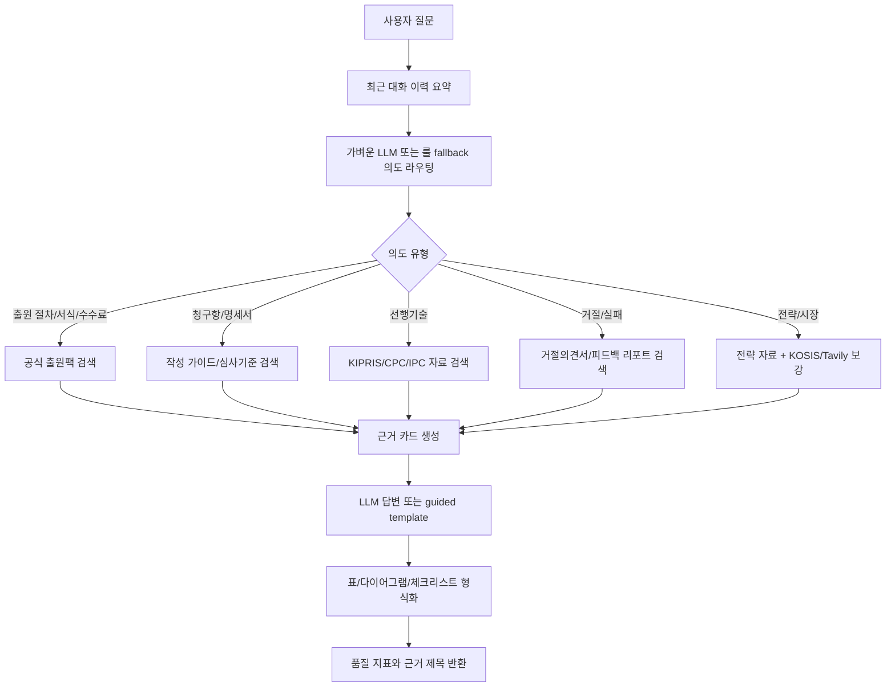

# Chatbot Business Batch Test Summary

- Generated at: 2026-06-07T15:51:59
- Execution mode: functional
- Output directory: `chatbot/data/artifacts/chatbot_business_tests/patent_100_each_20260607_1552`

## Patent Chatbot

- Total / success / failed: 1000 / 1000 / 0
- Avg elapsed: 0.005 sec
- Avg source count: 3.477
- Avg quality score: 0.4731
- Intent counts: `{"patent_original": 175, "patent_report": 400, "general": 300, "comparison": 100, "wiki": 25}`
- Answer mode counts: `{"None": 1000}`

## Patent Application Chatbot

- Total / success / failed: 0 / 0 / 0
- Avg elapsed: 0 sec
- Avg source count: 0
- Avg quality score: None
- Intent counts: `{}`
- Answer mode counts: `{}`

## Patent Application Chatbot Flow

## Saved Files

- `patent_questions.jsonl`
- `application_questions.jsonl`
- `patent_chat_results.jsonl`
- `application_chat_results.jsonl`
- `summary.json`
- `summary.md`
