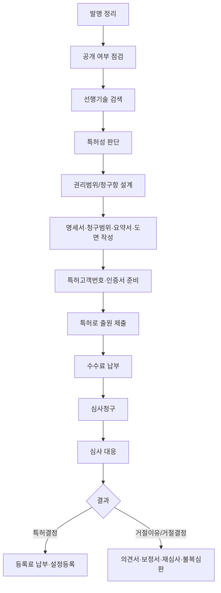

# 특허 출원 프로세스 가이드

생성일: 2026-06-01

## 전체 흐름

## 단계별 프로세스

| 단계 | 이름 | 해야 할 일 | 기반 자료 | 산출물 | 공식근거 |
|---|---|---|---|---|---|
| 1 | 발명 정리 | 문제-해결수단-효과를 1문장으로 정리 | 발명노트, 실험/개발자료, 도면, 코드 구조 | 발명의 핵심 차별점 1~3개 | SRC-017 |
| 2 | 공개 여부 점검 | 이미 논문/블로그/제품/발표로 공개했는지 확인 | 공개일, 공개 매체, 자료 URL/파일 | 신규성 리스크와 공지예외 가능성 검토 | SRC-005 |
| 3 | 선행기술 검색 | KIPRIS에서 키워드·동의어·IPC/CPC·출원인 검색 | 핵심 키워드, 유사 특허번호, 공개/등록공보 | 유사 기술 목록과 차이점 표 | SRC-012, SRC-013, SRC-014 |
| 4 | 특허성 판단 | 산업상 이용가능성·신규성·진보성 점검 | 선행기술 대비 구성요소 차이 | 출원 가능/보완 필요/출원 보류 결정 | SRC-005, SRC-006 |
| 5 | 권리범위 설계 | 청구항으로 보호받을 핵심 구성을 정함 | 제품/서비스의 필수 구성, 회피설계 가능성 | 독립항/종속항 초안 | SRC-006, SRC-017 |
| 6 | 명세서 작성 | 기술분야, 배경기술, 해결과제, 해결수단, 효과, 실시예, 도면 설명 작성 | 도면, 실시예, 변형예, 데이터 | 명세서·청구범위·요약서·도면 | SRC-001, SRC-006 |
| 7 | 출원 사전절차 | 특허고객번호 발급 및 인증서 등록 | 인감/서명 이미지, 증명서류, 공동인증서 | 특허고객번호와 전자출원 준비 완료 | SRC-002, SRC-003 |
| 8 | 특허로 제출 | 특허출원서와 첨부서류 제출 | 출원서, 명세서, 요약서, 도면, 감면 증명서류 | 출원번호통지서, 납부자번호 | SRC-001 |
| 9 | 수수료 납부 | 제출 당일 또는 다음날까지 수수료 납부 | 납입고지서/납부자번호 | 출원료 납부 완료 | SRC-001, SRC-004 |
| 10 | 심사청구 | 출원일부터 3년 이내 심사청구 | 심사청구서, 청구범위 포함 명세서 | 심사 착수 대기 | SRC-001 |
| 11 | 심사 대응 | 거절이유통지 시 의견서/보정서 제출 | 거절이유 분석표, 보정안, 의견서 | 등록결정 또는 거절결정 | SRC-005, SRC-006, SRC-009 |
| 12 | 등록료 납부 | 특허결정 후 등록료 납부 | 특허결정서, 납입고지서 | 설정등록, 특허권 발생 | SRC-001, SRC-005 |
| 13 | 실패/거절 후 대응 | 재심사, 보정안 리뷰, 거절결정불복심판, 분할/변경/재출원 검토 | 거절결정서, 선행문헌, 보정 가능성 | 재도전 전략 또는 포기 결정 | SRC-005, SRC-009, SRC-010, SRC-011 |

## 출원할 때 무엇을 찾아야 하나?

1. 같은 문제를 해결한 기존 특허
2. 내 발명의 핵심 구성요소가 이미 공개된 특허/논문/제품문서
3. 같은 IPC/CPC 분류에 속한 대표 문헌
4. 경쟁사 또는 유사 제품 출원인의 공개/등록공보
5. 해외 패밀리 특허와 인용/피인용 문헌
6. 내 발명과 가장 가까운 선행기술 3~5개
7. 선행기술과 내 발명의 차이점, 효과, 실험데이터

## 무엇을 기반으로 명세서와 청구항을 작성해야 하나?

- 제품/서비스에서 반드시 구현되어야 하는 필수 구성
- 선행기술과의 차이점
- 차이점으로 인해 발생하는 효과
- 실제 구현 가능한 실시예
- 회피설계를 막기 위한 변형예
- 사업상 반드시 보호해야 할 기능/구조/알고리즘
- 나중에 보정할 수 있도록 최초 명세서에 충분히 넣어둘 내용

## 핵심 체크리스트

| 분류 | 체크 항목 | 완료 기준 |
|---|---|---|
| 발명정리 | 문제/해결수단/효과 1문장 작성 | 누가 봐도 기술적 차이가 드러남 |
| 발명정리 | 필수 구성요소와 선택 구성요소 분리 | 청구항 독립항/종속항 후보 확보 |
| 선행기술 | KIPRIS 키워드 검색 | 핵심 키워드 5개 이상, 유사문헌 10개 이상 검토 |
| 선행기술 | IPC/CPC 분류 검색 | 대표 분류코드 1~3개 확인 |
| 선행기술 | 인용/피인용/패밀리 확인 | 가장 가까운 선행문헌 3~5개 선정 |
| 특허성 | 신규성 검토 | 모든 구성요소가 하나의 선행문헌에 그대로 있는지 확인 |
| 특허성 | 진보성 검토 | 여러 선행문헌 조합으로 쉽게 도출되는지 검토 |
| 명세서 | 실시예와 변형예 작성 | 통상의 기술자가 실시 가능할 정도로 구체화 |
| 명세서 | 도면 부호와 설명 일치 | 도면 번호/부호/설명이 서로 맞음 |
| 청구항 | 독립항은 넓게, 종속항은 방어적으로 | 사업 핵심을 보호하면서 선행기술과 차별 |
| 제출 | 특허고객번호/인증서 준비 | 특허로 로그인이 가능 |
| 제출 | 수수료/감면 서류 확인 | 납부기한 및 감면 증빙 확인 |
| 심사 | 거절이유 대응표 준비 | 청구항별 거절이유와 대응논리 정리 |
