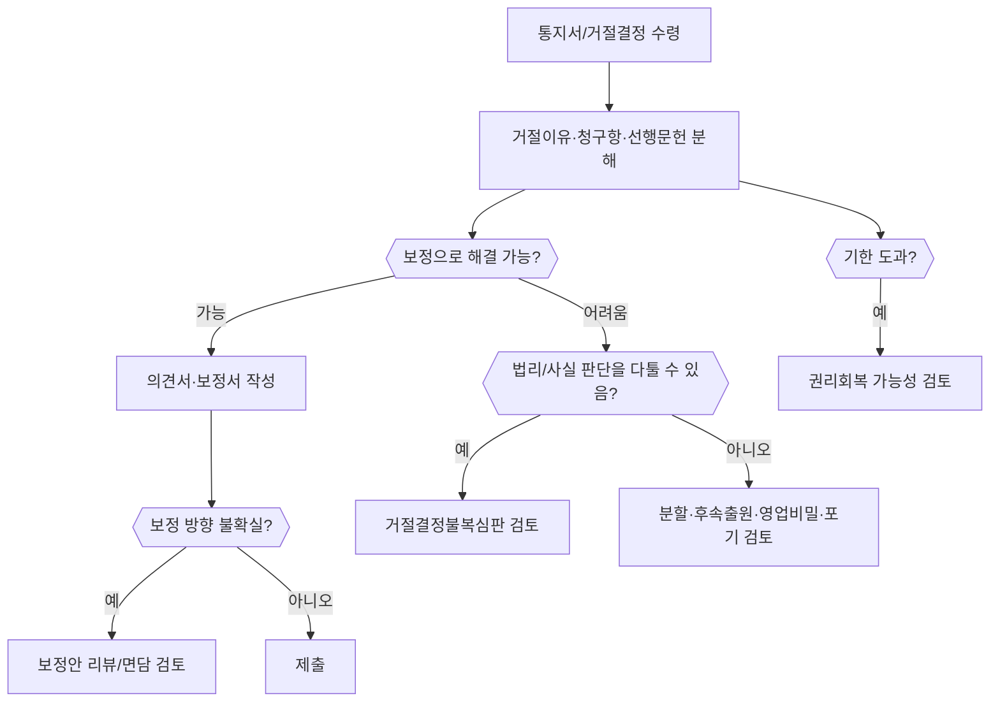

# 특허 출원 실패·거절 후 대응 가이드

생성일: 2026-06-01

## 먼저 확인할 것

- 통지서 종류: 의견제출통지서, 최후거절이유통지서, 거절결정서, 보정각하결정 등
- 각 청구항별 거절이유
- 인용된 선행문헌 번호와 관련 부분
- 제출기한
- 보정 가능 범위
- 사업상 포기 가능한 구성과 반드시 지킬 구성

## 대응표

| 상황 | 해야 할 일 | 판단 기준 | 공식 근거/자료 |
|---|---|---|---|
| 의견제출통지서 수령 | 거절이유를 조문/청구항/선행문헌별로 분해하고 의견서·보정서 초안 작성 | 신규성/진보성/기재불비/단일성 등 유형 식별 | SRC-005, SRC-006 |
| 보정 방향이 애매함 | 보정안 리뷰 신청 검토 | 보정서 제출기간 만료 1개월 이전 여부, 보정안 준비 여부 | SRC-009 |
| 보정으로 해결 가능 | 청구항을 좁히거나 실시예/구성 정합성 보정 후 의견서 제출 | 신규사항 추가 금지, 권리범위가 사업상 의미 있는지 | SRC-006 |
| 거절결정 수령 | 재심사청구 또는 거절결정불복심판 검토 | 보정으로 해결 가능하면 재심사, 법리/사실 판단 다툼이면 심판 | SRC-005, SRC-010 |
| 보정각하 | 보정각하결정불복심판 또는 보정 범위 재검토 | 보정요건 위반 여부, 신규사항/청구범위 확장 여부 | SRC-006, SRC-010 |
| 기한을 놓침 | 권리회복 심사 가이드라인으로 구제 가능성 검토 | 정당한 사유, 신청기간, 증빙자료 | SRC-011 |
| 권리범위가 너무 좁아짐 | 분할출원/후속출원/개량발명 출원 검토 | 원출원 기재범위, 사업상 필수 구성, 회피설계 가능성 | SRC-005, SRC-006 |
| 선행기술이 너무 강함 | 출원 포기, 비공개 노하우/영업비밀 관리, 개선발명 재설계 | 차별 구성 부재, 진보성 확보 어려움 | SRC-006, SRC-017 |

## 실무 판단 흐름

## 대응 문서 초안 구조

1. 사건 표시: 출원번호, 발명의 명칭, 통지서/결정서 일자
2. 거절이유 요약: 청구항별, 조문별
3. 보정 내용 요약: 어느 청구항을 어떻게 보정했는지
4. 선행문헌 대비표: 구성요소별 차이
5. 의견: 신규성/진보성/기재요건 충족 논리
6. 결론: 거절이유 해소 및 특허결정 요청
