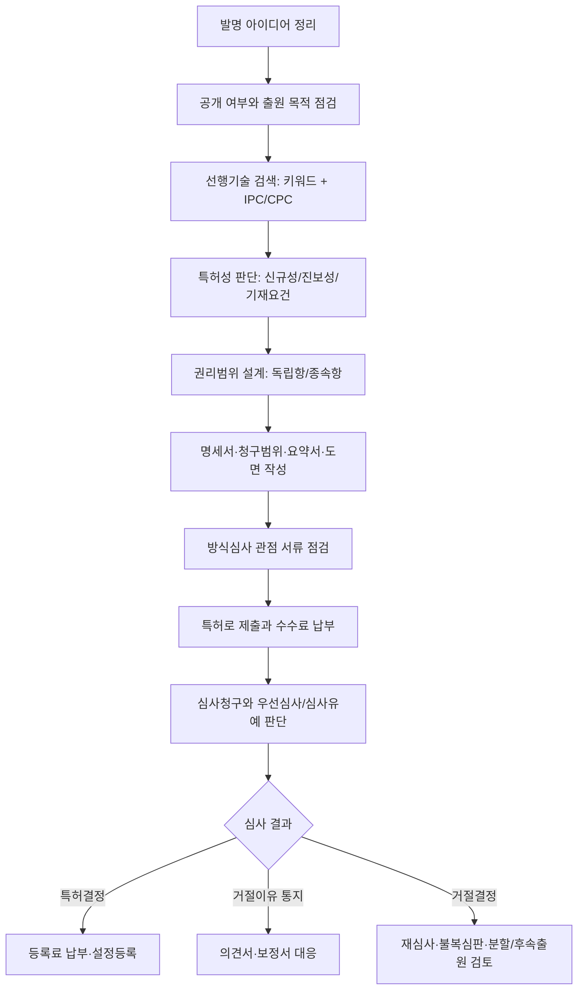

# 특허 출원 프로세스 가이드

생성/갱신일: 2026-06-04

## 현재 로컬 공식팩 기준

이 문서는 `downloads` 폴더에 실제로 남아있는 공식 PDF를 기준으로 정리한다. 챗봇은 아래 자료를 우선 근거로 사용한다.

| 로컬 파일 | 챗봇에서 쓰는 역할 |
|---|---|
| `13.2026 지식재산권의 손쉬운 이용.pdf` | 출원 전 준비, 출원 절차, 심사, 등록, 수수료, 제도 개요 |
| `출원방식심사기준.pdf` | 출원서/명세서/도면/요약서 등 방식심사와 서류 형식 점검 |
| `기술분야별 심사실무가이드 2026.03.pdf` | 기술분야별 신규성, 진보성, 기재요건 판단 관점 |
| `IP정보 활용 길라잡이.pdf` | 선행기술조사, 특허정보 검색, 특허맵/동향 분석 |
| `CPC 매뉴얼 2020.pdf` | CPC 분류체계 이해와 분류 기반 검색 |
| `PCT 국제조사 및 국제예비심사 가이드라인.pdf` | 해외/PCT 출원, 국제조사, 국제예비심사 검토 |

## 전체 흐름

## 단계별 실행 순서

| 단계 | 해야 할 일 | 판단 포인트 | 주 근거 파일 |
|---|---|---|---|
| 1 | 발명의 문제, 해결수단, 효과를 한 문장으로 정리 | 단순 아이디어가 아니라 기술적 구성과 효과가 드러나는가 | `13.2026 지식재산권의 손쉬운 이용.pdf` |
| 2 | 논문, 전시, 제품출시, 블로그 등 공개 이력을 확인 | 공개 전에 출원 가능한가, 공개됐다면 공지예외 검토가 필요한가 | `13.2026 지식재산권의 손쉬운 이용.pdf` |
| 3 | KIPRIS/특허정보 검색 키워드와 동의어를 뽑음 | 한글/영문/약어/구성요소/효과 키워드가 모두 있는가 | `IP정보 활용 길라잡이.pdf` |
| 4 | IPC/CPC 분류를 활용해 같은 기술군을 검색 | 키워드가 달라도 같은 분류의 유사문헌을 찾았는가 | `CPC 매뉴얼 2020.pdf` |
| 5 | 가장 가까운 선행문헌 3~5개를 선정 | 모든 구성요소가 이미 공개됐는가, 조합이 쉬운가 | `기술분야별 심사실무가이드 2026.03.pdf` |
| 6 | 독립항과 종속항 초안을 설계 | 넓게 보호하되 선행기술과 차별되는 핵심 구성이 들어갔는가 | `기술분야별 심사실무가이드 2026.03.pdf` |
| 7 | 명세서와 도면을 작성 | 실시 가능할 정도로 구체적인 실시예와 변형예가 있는가 | `출원방식심사기준.pdf` |
| 8 | 제출 전 방식심사 항목을 점검 | 서류 형식, 도면 부호, 요약서, 청구범위 형식이 맞는가 | `출원방식심사기준.pdf` |
| 9 | 심사청구, 우선심사, 해외/PCT 전략을 선택 | 사업 일정, 공개 일정, 해외 진입국, 비용을 반영했는가 | `13.2026 지식재산권의 손쉬운 이용.pdf`, `PCT 국제조사 및 국제예비심사 가이드라인.pdf` |
| 10 | 거절이유가 오면 청구항별 대응표를 만든다 | 보정으로 해결할지, 의견 주장으로 해결할지, 분할/후속출원이 필요한가 | `기술분야별 심사실무가이드 2026.03.pdf`, `출원방식심사기준.pdf` |

## 챗봇 답변 원칙

- “처음 특허 출원할 때 어떤 순서로 준비해야 해?”는 `application_procedure`로 라우팅한다.
- 처음 출원 절차 질문에는 거절의견서 대응을 앞세우지 않는다. 거절/실패/의견서가 명시될 때만 `rejection_response`로 라우팅한다.
- 시장성, 사업화, 통계, 최신 동향이 명시되면 외부 검색을 보강하되, 먼저 로컬 공식팩에서 절차와 판단 기준을 잡는다.
- 근거는 “데이터 1” 대신 파일명과 문서 역할이 드러나게 표시한다.
- 실패특허 case가 선택되어 있어도, 순수한 “처음 출원 절차” 질문이면 공용 공식팩을 우선한다. case 원문과 보고서는 사용자가 실패 원인, 평가, 보정 방향, 등록 가능성을 물을 때 함께 사용한다.
- 답변은 `목적 정리 -> 선행기술조사 -> 청구항/명세서 작성 -> 제출/심사전략 -> 다음 액션` 순서로 구성한다.

## 출원 도우미에서 이 문서를 쓰는 경우

| 사용자 질문 | 라우팅 | 답변 구성 |
|---|---|---|
| 처음 특허 출원할 때 어떤 순서로 준비해야 해? | `application_procedure` | 실행 순서, 준비물, 판단 포인트, 다음 액션 |
| 출원 전에 무엇을 먼저 확인해야 해? | `application_procedure` | 공개 리스크, 선행기술, 권리화 목적, 일정 |
| 필요한 서류만 알려줘 | `forms_and_filing` | 출원서, 명세서, 청구범위, 도면, 요약서 |
| 우선심사를 해야 할까? | `application_strategy` | 사업 일정, 기술분야, 비용, 심사속도 관점 |
| 해외출원은 언제 판단해야 해? | `application_strategy` | 우선권 기간, PCT/개별국, 공개 일정 |

## 출원 준비 체크리스트

| 분류 | 체크 항목 | 완료 기준 |
|---|---|---|
| 발명정리 | 문제-해결수단-효과 정리 | 핵심 차별점 1~3개가 문장으로 정리됨 |
| 공개관리 | 공개일과 공개 매체 확인 | 출원 전 공개 리스크와 공지예외 가능성 확인 |
| 선행기술 | 키워드·동의어·IPC/CPC 검색 | 유사문헌 목록과 차이점 표 확보 |
| 특허성 | 신규성·진보성·기재요건 검토 | 거절 가능성이 높은 부분이 표시됨 |
| 권리범위 | 독립항·종속항 초안 작성 | 사업 핵심과 회피설계 방어 구성이 반영됨 |
| 명세서 | 실시예·변형예·도면 설명 작성 | 통상의 기술자가 실시 가능할 정도로 구체적 |
| 제출 | 방식심사 항목 점검 | 출원서, 명세서, 청구범위, 도면, 요약서 형식 확인 |
| 전략 | 심사청구·우선심사·해외출원 판단 | 사업 일정과 비용에 맞는 전략 선택 |
