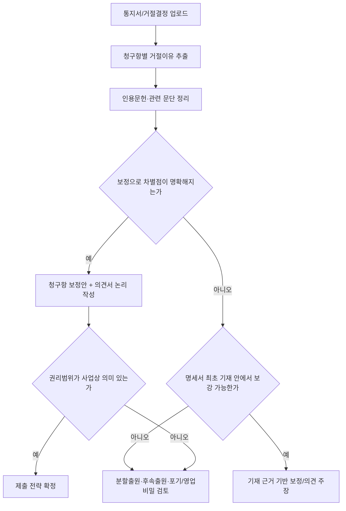

# 특허 출원 실패·거절 후 대응 가이드

생성/갱신일: 2026-06-04

## 현재 로컬 자료로 판단할 수 있는 범위

현재 `downloads` 폴더에는 실제 사건의 의견제출통지서나 거절결정서 원본이 없다. 따라서 이 문서는 사용자가 별도로 업로드한 의견서/통지서/거절결정서 PDF를 분석할 때, 로컬 공식팩을 기준으로 어떤 기준을 적용할지 정리한 가이드다.

| 로컬 파일 | 거절/실패 분석에서 쓰는 역할 |
|---|---|
| `기술분야별 심사실무가이드 2026.03.pdf` | 신규성, 진보성, 기재요건, 기술분야별 심사 관점 |
| `출원방식심사기준.pdf` | 방식심사, 서류 형식, 보정서/명세서 형식 리스크 |
| `13.2026 지식재산권의 손쉬운 이용.pdf` | 심사 절차, 의견서/보정서 대응, 등록/심판 등 제도 개요 |
| `IP정보 활용 길라잡이.pdf` | 인용문헌/선행기술 재검색, 특허정보 기반 차이점 분석 |
| `CPC 매뉴얼 2020.pdf` | 인용문헌과 내 발명의 분류·기술군 비교 |
| `PCT 국제조사 및 국제예비심사 가이드라인.pdf` | PCT/해외 출원에서 국제조사·예비심사 의견 대응 |

## 먼저 추출해야 할 정보

| 항목 | 왜 중요한가 |
|---|---|
| 통지서/결정서 종류 | 의견제출통지인지, 최후거절인지, 거절결정인지에 따라 대응 수단이 달라진다 |
| 제출기한 | 보정서, 의견서, 재심사, 불복심판 가능 기간을 판단한다 |
| 거절되는 청구항 | 모든 청구항인지 일부 청구항인지 확인해야 권리범위 전략을 세울 수 있다 |
| 적용 조문/거절유형 | 신규성, 진보성, 기재불비, 명확성, 단일성, 방식요건 중 무엇인지 분류한다 |
| 인용문헌과 관련 문단 | 선행기술 대비표와 보정 방향의 출발점이다 |
| 심사관의 핵심 문장 | 어떤 구성을 인정하지 않았는지, 어떤 효과를 불충분하다고 봤는지 확인한다 |

## 대응 흐름



## 거절유형별 분석 기준

| 유형 | 확인 기준 | 챗봇 피드백 방향 | 주 근거 파일 |
|---|---|---|---|
| 신규성 | 하나의 선행문헌에 청구항 모든 구성이 있는지 | 없는 구성요소와 효과를 표로 분리 | `기술분야별 심사실무가이드 2026.03.pdf` |
| 진보성 | 여러 선행문헌 조합이 쉬운지, 결합 동기가 있는지 | 차이 구성, 작용효과, 결합 곤란성을 정리 | `기술분야별 심사실무가이드 2026.03.pdf` |
| 기재불비 | 실시 가능성, 뒷받침, 명확성이 부족한지 | 명세서 원문에서 보정 근거를 찾고 부족하면 후속출원 제안 | `기술분야별 심사실무가이드 2026.03.pdf` |
| 방식요건 | 서류 형식, 도면, 요약서, 청구범위 기재 방식 문제인지 | 형식 오류와 보완 서류를 분리 | `출원방식심사기준.pdf` |
| 분류/검색 누락 | 같은 CPC/IPC 기술군의 핵심 문헌이 빠졌는지 | CPC 기반 재검색과 차이점 표 작성을 제안 | `CPC 매뉴얼 2020.pdf`, `IP정보 활용 길라잡이.pdf` |
| 해외/PCT 리스크 | 국제조사 견해서, 국제예비심사 의견 대응인지 | 국내 대응과 PCT 대응을 분리 | `PCT 국제조사 및 국제예비심사 가이드라인.pdf` |

## 챗봇 피드백 출력 구조

1. 사건 요약: 문서 종류, 기한, 주요 거절유형
2. 청구항별 문제: 청구항 번호, 거절이유, 인용문헌
3. 실패 원인: 신규성/진보성/기재요건/방식요건/전략 문제로 분류
4. 수정 방향: 보정 가능한 구성, 의견서 주장 포인트, 피해야 할 보정
5. 보고서 생성 연결: 기존 특허 원문/평가 보고서가 있으면 평가 로직으로 재분석
6. 후속 액션: 보정서, 의견서, 재심사, 불복심판, 분할/후속출원, 포기 판단

## 현재 출원 도우미 적용 규칙

출원 도우미에서 실패/거절 질문이 들어오면 공용 공식팩만으로 일반론을 답하지 않는다. 먼저 현재 선택된 실패특허 case의 vectorstore를 확인한다.

```text
failed_patent/<registration_number>_failed/
  input/              # 실패특허 원본 PDF
  rejection/          # 선택 거절의견서/사유서
  reports/            # latest_report.md/json/html
  index/vectorstore/  # 해당 case 전용
```

검색 우선순위:

1. 선택 case의 `reports/latest_report.*`
2. 선택 case의 `rejection/` 문서
3. 선택 case의 `input/` 원본 PDF
4. 공용 공식팩의 심사 기준/거절 대응 가이드
5. 사용자가 최신 선행기술이나 시장을 요청한 경우에만 외부 검색

답변은 아래 항목을 가능한 한 모두 포함한다.

| 항목 | 설명 |
|---|---|
| 평가 요약 | 보고서에 나온 점수, 등급, 주요 리스크 |
| 실패 원인 | 신규성, 진보성, 기재요건, 방식요건, 전략 문제로 구분 |
| 청구항별 문제 | 독립항/종속항 중 문제가 되는 구성과 근거 |
| 보정 방향 | 최초 명세서 안에서 보정 가능한 구성과 피해야 할 신규사항 |
| 등록 가능성 개선 | 차별 구성 강화, 실시예 보강, 효과 데이터, 선행기술 대비표 |
| 다음 액션 | 의견서, 보정서, 재심사, 분할/후속출원, 포기/영업비밀 판단 |

## 주의

- 최초 명세서에 없는 내용을 새로 넣는 보정은 위험하다.
- 권리범위를 지나치게 좁히면 등록 가능성은 올라가도 사업적 가치가 떨어질 수 있다.
- 거절의견서 원본이 없으면 챗봇은 일반 대응 전략만 줄 수 있다. 실제 청구항·인용문헌 기반 피드백에는 원본 PDF나 텍스트가 필요하다.
- 여러 실패특허 case의 원문이나 보고서를 한 답변에서 섞어 쓰지 않는다.
