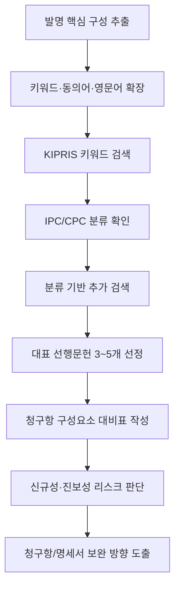

# 선행기술조사 워크플로우

생성/갱신일: 2026-06-04

## 현재 로컬 근거

| 로컬 파일 | 선행기술조사에서 쓰는 역할 |
|---|---|
| `IP정보 활용 길라잡이.pdf` | 특허정보 검색, 결과 활용, 특허맵/동향 분석 |
| `CPC 매뉴얼 2020.pdf` | CPC 분류 검색과 기술군 확장 |
| `13.2026 지식재산권의 손쉬운 이용.pdf` | 출원 전 검색과 출원 절차의 전체 맥락 |
| `기술분야별 심사실무가이드 2026.03.pdf` | 신규성/진보성 판단 관점 |
| `PCT 국제조사 및 국제예비심사 가이드라인.pdf` | 해외/PCT 관점의 국제조사와 예비심사 |

## 조사 흐름

## 단계별 작업

| 단계 | 작업 | 설명 | 주 근거 파일 |
|---|---|---|---|
| 1 | 발명 분해 | 문제, 해결수단, 구성요소, 효과를 분리 | `13.2026 지식재산권의 손쉬운 이용.pdf` |
| 2 | 검색어 확장 | 한글/영문/약어/동의어/상위어/하위어를 만든다 | `IP정보 활용 길라잡이.pdf` |
| 3 | 1차 검색 | KIPRIS 등에서 넓게 검색해 대표 문헌을 찾는다 | `IP정보 활용 길라잡이.pdf` |
| 4 | 분류 확인 | 가까운 문헌의 IPC/CPC를 확인한다 | `CPC 매뉴얼 2020.pdf` |
| 5 | 분류 검색 | 같은 CPC/IPC 안에서 키워드가 다른 문헌을 찾는다 | `CPC 매뉴얼 2020.pdf` |
| 6 | 차이점 표 | 내 발명과 선행문헌의 구성요소를 1:1로 비교한다 | `기술분야별 심사실무가이드 2026.03.pdf` |
| 7 | 위험도 판단 | 신규성, 진보성, 기재요건 리스크를 구분한다 | `기술분야별 심사실무가이드 2026.03.pdf` |
| 8 | 출원 전략 반영 | 청구항 범위, 실시예, 변형예, 해외/PCT 전략에 반영한다 | `PCT 국제조사 및 국제예비심사 가이드라인.pdf` |

## 검색식 예시

| 목적 | 예시 |
|---|---|
| 핵심 구성 검색 | `핵심기술 AND 핵심구성` |
| 동의어 확장 | `동의어1 OR 동의어2 OR 영문어` |
| 제외어 적용 | `핵심기술 NOT 제외어` |
| 정확한 구문 | `"정확한 기술구문"` |
| 분류 결합 | `CPC분류 + 핵심 키워드` |
| 출원인/경쟁사 | `출원인명 + 핵심기술` |

## 결과 정리 표

| 문헌번호 | 제목 | 출원인 | 공개/등록일 | IPC/CPC | 같은 구성 | 다른 구성 | 인용/피인용 | 리스크 |
|---|---|---|---|---|---|---|---|---|

## 챗봇 답변 원칙

- 선행기술조사 질문은 먼저 로컬 공식팩의 조사 절차와 CPC 기준을 사용한다.
- 특정 기술 분야의 최신 문헌, 시장 동향, 경쟁사 현황이 필요할 때만 외부 검색을 보강한다.
- 외부 검색 결과는 승인된 위키/감사 프로세스를 거쳐야 장기 vectorstore에 반영한다.
- 실패특허 case가 선택된 상태에서 선행기술조사를 물으면, 현재 case의 청구항과 보고서에서 문제 구성을 먼저 뽑은 뒤 검색식을 제안한다.
- “어떻게 고치면 등록 가능성이 올라가?”라는 질문에서는 선행기술조사를 단순 검색 목록이 아니라 청구항 보정과 명세서 보강 전략으로 연결한다.

## 실패특허 보정 전략으로 연결하는 출력

| 출력 항목 | 설명 |
|---|---|
| 핵심 구성 분해 | 독립항의 필수 구성요소와 효과를 분리 |
| 인용/유사문헌 대비 | 같은 구성, 다른 구성, 결합 동기, 효과 차이를 표로 정리 |
| 신규성 리스크 | 하나의 문헌에 모든 구성이 있는지 판단 |
| 진보성 리스크 | 문헌 조합이 쉬운지, 결합 동기가 명확한지 판단 |
| 보정 후보 | 최초 명세서 안에서 추가 가능한 한정 구성 |
| 명세서 보강 | 실시예, 변형예, 효과 데이터, 도면 설명 보강 포인트 |
| 후속 검색식 | KIPRIS/CPC/키워드 확장 검색식 |

출원 도우미 답변은 “검색 결과 나열”에서 끝나지 않고, 선행기술 대비 어떤 청구항 문구를 좁히거나 명세서에서 어떤 근거를 찾아야 하는지까지 연결해야 한다.
