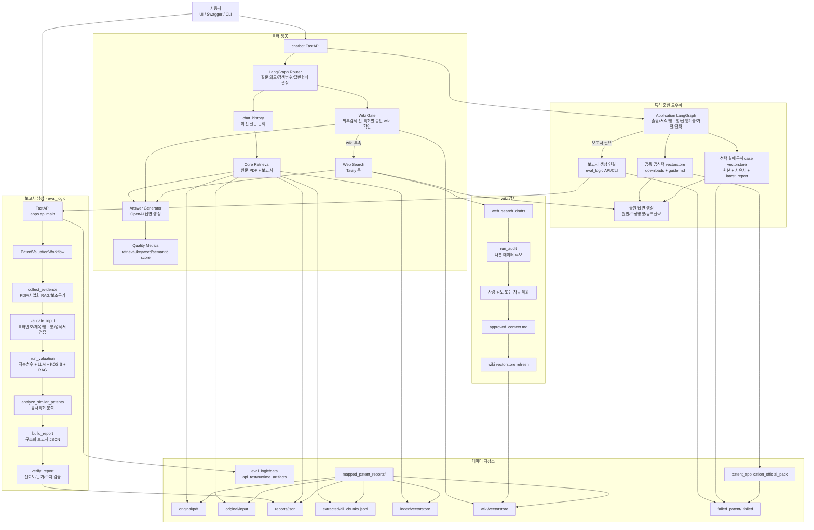
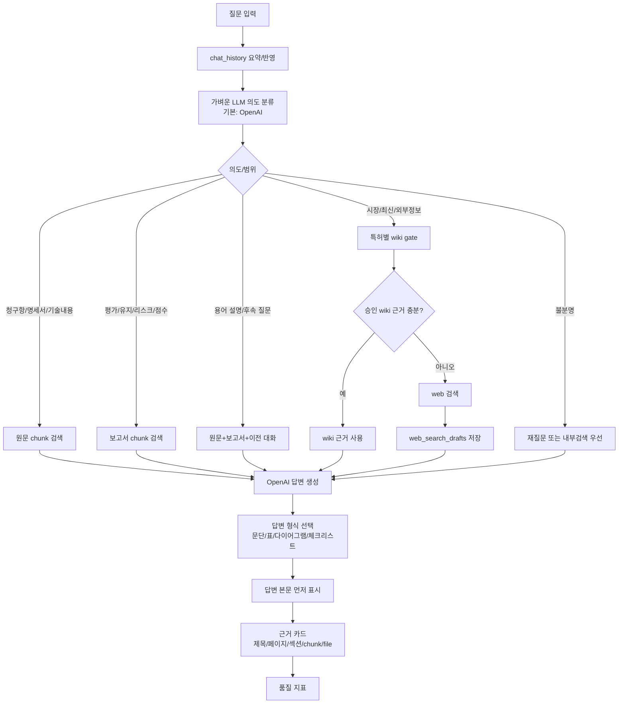
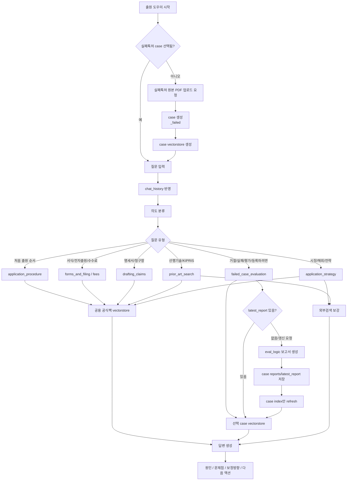
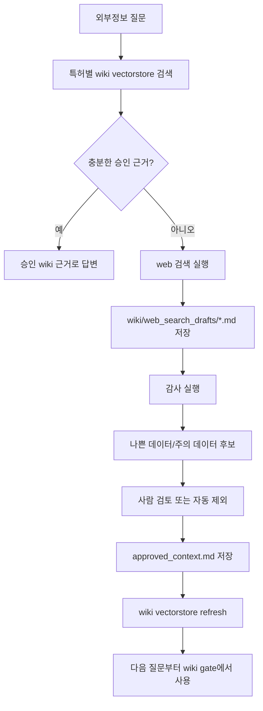

# 챗봇/출원도우미/감사/보고서 전체 아키텍처와 사용설명서

이 문서는 `chatbot`, `eval_logic`, `chatbot/data`가 어떻게 연결되는지 발표와 테스트 기준으로 정리한 문서입니다.

## 1. 시스템 역할

| 영역 | 역할 | 핵심 데이터 |
| --- | --- | --- |
| `eval_logic` | 특허 PDF/JSON을 표준 입력으로 정규화하고 평가 보고서 JSON을 생성합니다. | `eval_logic/data/api_test`, `eval_logic/data/runtime_artifacts`, 특허별 보고서 |
| 특허 챗봇 | 특허 원문, 보고서, 승인 wiki, web 검색 근거로 질의응답합니다. | `chatbot/data/mapped_patent_reports/<patent_id>` |
| 출원 도우미 | 공식 출원 자료팩과 선택 실패특허 case를 기준으로 출원/거절/실패 분석을 답변합니다. | `chatbot/data/patent_application_official_pack` |
| wiki 감사 | web 검색 draft와 wiki 보강 자료를 감사하고 승인 데이터만 vectorstore에 반영합니다. | `wiki/approved_context.md`, `wiki/vectorstore` |
| UI/Swagger | 챗봇, 출원도우미, 감사, 전처리, workflow를 직접 테스트합니다. | `/ui`, `/docs` |

## 2. 전체 아키텍처



## 3. 특허 챗봇 workflow

특허 챗봇은 “질문을 받으면 바로 검색”하지 않고, 먼저 의도와 범위를 정합니다.



검색 경로 원칙:

- “이 특허의 평가가 어떻게 나왔어?”는 보고서 검색을 우선합니다.
- “청구항 1이 뭐야?”는 원문/청구항 chunk를 우선합니다.
- “최근 시장 동향도 알려줘”는 wiki gate를 확인한 뒤 부족하면 web 검색을 합니다.
- “방금 말한 리스크 더 자세히”처럼 이어지는 질문은 `chat_history`를 반영합니다.
- 의도가 불명확하면 무조건 web 검색으로 보내지 않고 내부 데이터와 대화 문맥을 먼저 봅니다.

## 4. 출원 도우미 workflow

출원 도우미는 공용 공식팩만으로 모든 질문을 답하지 않습니다. 실패특허를 분석하는 질문은 반드시 현재 선택한 실패특허 case index를 함께 사용합니다.



출원 도우미 답변 원칙:

- 처음 출원 절차 질문에는 거절 대응 내용을 먼저 섞지 않습니다.
- 실패/거절/평가 질문에는 현재 case의 원본 PDF, 사유서, 최신 보고서를 우선합니다.
- “왜 실패했어?”, “뭘 고치면 등록 가능성이 올라가?”는 원인, 청구항 보정 방향, 명세서 보강, 선행기술 차별점, 절차 액션으로 나눠 답합니다.
- 공용 공식팩은 절차와 제도 설명의 기준이고, case index는 사용자가 올린 실패특허 1건의 사실 근거입니다.
- 다른 실패특허 case는 검색하지 않습니다.

## 5. wiki 감사 workflow

wiki는 외부검색 결과를 바로 정답 근거로 고정하지 않기 위한 안전장치입니다.



감사 기준:

- 특허와 무관한 내용
- “찾을 수 없음”, “데이터 없음”처럼 답변 근거로 부적절한 문장
- 제목과 본문이 불일치하는 검색 결과
- 동일 문장 과다 중복
- 출처 URL이 없거나 신뢰도가 낮은 결과
- 개인정보/주소 등 답변 품질을 떨어뜨리는 불필요한 원문

## 6. UI 사용법

서버 실행:

```bash
cd /Users/kgw/skipers-ai
PYTHONPATH="$PWD" python3 -m uvicorn chatbot.app.main:app --reload --host 127.0.0.1 --port 8001
```

접속:

```text
http://127.0.0.1:8001/ui
```

### 특허 챗봇 탭

1. 특허를 선택합니다.
2. 질문을 입력합니다.
3. 답변 본문을 먼저 확인합니다.
4. 근거 카드를 눌러 어떤 파일, 페이지, 섹션, chunk에서 왔는지 확인합니다.
5. 이어지는 질문은 UI가 `chat_history`와 함께 보냅니다.

예시 질문:

```text
CMP Pad 물류 관리 시스템의 유지 판단 근거를 알려줘
이 특허의 평가가 어떻게 나왔어?
방금 말한 리스크를 사업부 관점에서 다시 설명해줘
청구항 1의 핵심 구성을 표로 정리해줘
```

### 출원 도우미 탭

1. 실패특허 원본 PDF를 업로드합니다.
2. 선택 거절의견서나 사유서가 있으면 같이 업로드합니다.
3. case가 생성되면 해당 case를 선택합니다.
4. 필요하면 보고서 생성을 실행합니다.
5. 질문합니다.

예시 질문:

```text
처음 특허 출원할 때 어떤 순서로 준비해야 해?
이 실패특허는 왜 거절됐어?
청구항을 어떻게 고치면 등록 가능성이 올라가?
의견서 제출 전에 확인해야 할 리스크를 체크리스트로 알려줘
```

### 감사 탭

1. `감사`로 나쁜 데이터 후보를 생성합니다.
2. `검토서`에서 사람이 제외할 항목을 확인합니다.
3. `적용`으로 승인 Markdown을 저장하고 vectorstore를 갱신합니다.
4. 자동 모드에서는 주의/나쁜 데이터 후보를 제외하고 refresh합니다.

### Workflow 탭

- 특허 챗봇 Mermaid
- 출원 도우미 Mermaid
- 전처리/재색인 Mermaid
- wiki 감사 Mermaid

각 다이어그램은 실제 API workflow를 발표용으로 설명하기 위한 것입니다.

## 7. 주요 API

### 챗봇 공통

| API | 기능 |
| --- | --- |
| `GET /api/v1/chatbot/config` | 데이터 루트, 모델, 설정 확인 |
| `GET /api/v1/chatbot/data-links` | `chatbot/data` 연결 상태 확인 |
| `GET /api/v1/chatbot/patents` | 사용 가능한 특허 목록 |
| `GET /api/v1/chatbot/patents/{patent_id}` | 특허별 원문/보고서/wiki/index 상태 |
| `POST /api/v1/chatbot/preprocess/run` | 전처리, wiki 정리, vectorstore refresh, 출원 전처리 통합 실행 |
| `POST /api/v1/chatbot/vectorstore/refresh` | 감사 자동 적용 후 전체 vectorstore 재생성 |
| `GET /api/v1/chatbot/vectorstore/status` | vectorstore 상태 확인 |

### 특허 챗봇

| API | 기능 |
| --- | --- |
| `POST /api/v1/patent-chat/chat` | 선택 특허 기준 답변 |
| `POST /api/v1/patent-chat/global/chat` | 전체 특허 기준 답변 |
| `POST /api/v1/patent-chat/query` | retrieval hit 확인 |
| `POST /api/v1/patent-chat/answer` | 검색+답변 생성 확인 |
| `POST /api/v1/patent-chat/reindex` | 선택 특허 index 재생성 |
| `POST /api/v1/patent-chat/global/reindex` | 전체 특허 index 재생성 |
| `GET /api/v1/patent-chat/chat/mermaid` | 특허 챗봇 Mermaid |
| `GET /api/v1/patent-chat/ingestion/mermaid` | 전처리 Mermaid |
| `GET /api/v1/patent-chat/page-image` | PDF page image 렌더링 |

`/api/v1/rag`와 `/rag`는 호환용 alias입니다. 새 문서와 UI에서는 기능명인 `patent-chat`을 기준으로 설명합니다.

### 출원 도우미

| API | 기능 |
| --- | --- |
| `GET /api/v1/application/status` | 공식팩/index 상태 |
| `GET /api/v1/application/external/status` | KIPRIS/KOSIS/Tavily 연결 상태 |
| `POST /api/v1/application/preprocess` | 출원팩 전처리와 공용 index 갱신 |
| `POST /api/v1/application/index/refresh` | 공용 공식팩 vectorstore 갱신 |
| `POST /api/v1/application/chat` | 출원 도우미 답변 |
| `GET /api/v1/application/chat/mermaid` | 출원 도우미 Mermaid |
| `GET /api/v1/application/failed-patents` | 실패특허 case 목록 |
| `POST /api/v1/application/failed-patents/upload` | 실패특허 PDF와 선택 사유서 업로드 |
| `GET /api/v1/application/failed-patents/{case_id}` | case 상태 확인 |
| `POST /api/v1/application/failed-patents/{case_id}/report/generate` | eval_logic 보고서 생성 후 case reports 저장 |
| `POST /api/v1/application/failed-patents/{case_id}/report/save` | 외부 생성 보고서 저장 후 case index 갱신 |
| `POST /api/v1/application/failed-patents/{case_id}/index/refresh` | 선택 case index만 재생성 |
| `POST /api/v1/application/failed-patents/{case_id}/chat` | 선택 case 기준 출원 도우미 답변 |

### wiki 감사

| API | 기능 |
| --- | --- |
| `POST /api/v1/wiki/audit` | 나쁜 데이터 후보 감사 |
| `GET /api/v1/wiki/audit-review` | 사람 검토용 Markdown 확인 |
| `POST /api/v1/wiki/audit-apply` | 승인 Markdown 저장 및 vectorstore refresh |
| `POST /api/v1/wiki/audit-auto-refresh` | 자동 제외 후 승인 vectorstore refresh |
| `POST /api/v1/wiki/agent/run` | wiki LangGraph 직접 실행 |
| `GET /api/v1/wiki/agent/mermaid` | wiki 감사 Mermaid |

### eval_logic 보고서 API

| API | 기능 |
| --- | --- |
| `POST /api/v1/reports/patent-valuation/from-json` | JSON body로 보고서 생성 |
| `POST /api/v1/reports/patent-valuation/from-json-file` | JSON 파일 업로드로 보고서 생성 |
| `POST /api/v1/reports/patent-valuation/from-pdf` | PDF 업로드 후 보고서 생성 |
| `GET /api/v1/reports/{job_id}/status` | Job 상태 |
| `GET /api/v1/reports/{job_id}/result` | 보고서와 검증 결과 |
| `POST /api/v1/tools/patent-metadata` | PDF 메타데이터/입력 추출 |
| `POST /api/v1/tools/business-rag` | 사업화 RAG 평가 |
| `POST /api/v1/tools/auto-score` | 규칙 기반 점수 |
| `POST /api/v1/tools/llm-evaluation` | LLM 평가 |
| `POST /api/v1/tools/similar-patents` | 유사 특허 분석 |

## 8. CLI 명령

```bash
cd /Users/kgw/skipers-ai

# 챗봇 서버
bash chatbot/scripts/start_chatbot_server.sh

# 상태 확인
bash chatbot/scripts/preprocess_chatbot_data.sh --mode status

# wiki 승인 데이터 정리 + vectorstore refresh
bash chatbot/scripts/preprocess_chatbot_data.sh --mode refresh

# 나쁜 데이터 자동 감사 후 승인본만 refresh
bash chatbot/scripts/preprocess_chatbot_data.sh --mode auto-audit

# 출원 공식팩 전처리 + 공용 index 갱신
bash chatbot/scripts/preprocess_chatbot_data.sh --mode application-preprocess

# 실패특허 case 생성
bash chatbot/scripts/preprocess_chatbot_data.sh --mode application-case \
  --original-pdf "/path/to/failed.pdf" \
  --rejection-file "/path/to/rejection.pdf"

# 실패특허 보고서 생성 + 해당 case index refresh
bash chatbot/scripts/preprocess_chatbot_data.sh --mode application-case-generate \
  --case-id "10-1959619_failed"
```

## 9. 발표용 기능 정리

1. `eval_logic`은 특허 입력을 평가 보고서로 만드는 보고서 생성 에이전트입니다.
2. `chatbot`은 생성된 보고서와 원문을 다시 검색해서 사용자가 이해할 수 있는 답변으로 바꿉니다.
3. 특허 챗봇은 원문/보고서/core vectorstore를 기준으로 답하고, 외부정보가 필요할 때만 wiki gate와 web 검색을 사용합니다.
4. wiki는 특허별로 분리되어 있어 전체 vectorstore를 오염시키지 않습니다.
5. wiki draft는 감사 후 승인된 내용만 vectorstore에 들어갑니다.
6. 출원 도우미는 공용 공식팩 index와 선택 실패특허 case index를 함께 사용합니다.
7. 실패특허는 `<registration>_failed` 폴더 단위로 격리되어 다른 실패특허와 섞이지 않습니다.
8. 실패특허 보고서는 생성 후 해당 case의 `reports/latest_report.*`에 저장되고 그 case index만 갱신됩니다.
9. 답변은 본문, 근거 카드, 품질 지표 순서로 제공됩니다.
10. Swagger에서 전처리, 재색인, 감사, 보고서 생성, 출원 도우미 chat API를 모두 테스트할 수 있습니다.

## 10. 점검 체크리스트

```bash
# 문서/패치 공백 오류
git diff --check

# eval_logic API import
cd /Users/kgw/skipers-ai/eval_logic
python3 -c "import sys; sys.path.insert(0, 'src'); from apps.api.main import app; print(app.title)"

# chatbot API import
cd /Users/kgw/skipers-ai
PYTHONPATH="$PWD" python3 -c "from chatbot.app.main import app; print(app.title)"

# 챗봇 데이터 상태
bash chatbot/scripts/preprocess_chatbot_data.sh --mode status
```
