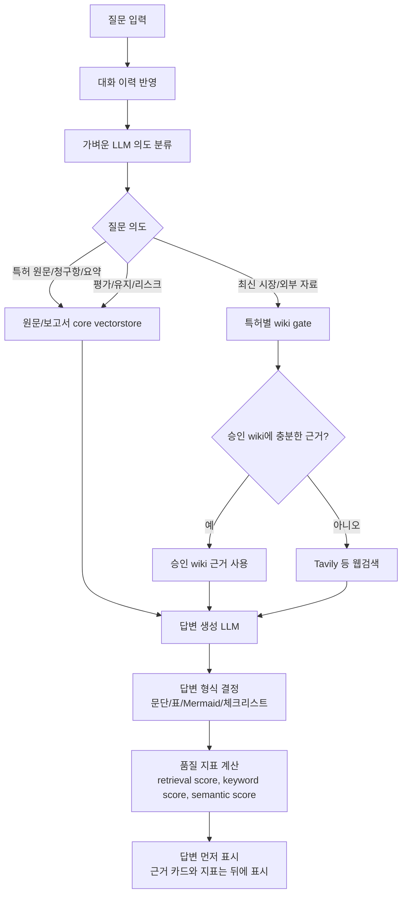
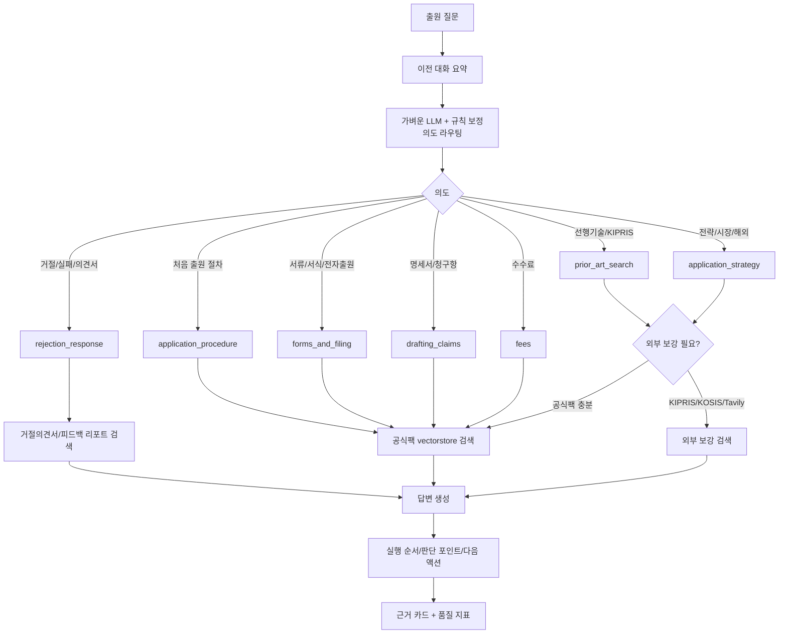

# 챗봇/출원도우미/감사/보고서 전체 아키텍처와 사용설명서

이 문서는 발표와 기능 점검을 위해 `chatbot`, `eval_logic`, 중앙 `data` 폴더가 어떻게 연결되는지 정리한 설명서입니다.

## 1. 전체 구조 요약

전체 시스템은 하나의 중앙 데이터 루트인 `data/`를 기준으로 동작합니다.

- `eval_logic`: 특허 원문 PDF 또는 특허 JSON을 입력받아 평가 보고서 JSON/HTML을 생성합니다.
- `chatbot`: 특허 원문, 평가 보고서, 승인 wiki, 출원 공식팩을 검색해서 답변을 생성합니다.
- `data/mapped_patent_reports/<patent_id>`: 특허별 원문, 보고서, wiki, vectorstore를 저장합니다.
- `data/patent_application_official_pack(1)`: 특허 출원 도우미가 쓰는 공식팩, 다운로드 자료, 거절의견서, 피드백 리포트를 저장합니다.
- `wiki 감사`: 승인되지 않은 임시 wiki/web draft를 바로 vectorstore에 넣지 않고, 감사와 승인 과정을 거쳐 반영합니다.

```mermaid
flowchart LR
  U[사용자<br/>UI / Swagger / CLI] --> UI[chatbot FastAPI<br/>/ui, /docs]
  U --> EV[eval_logic FastAPI<br/>보고서 생성 API]

  subgraph DATA[중앙 data 폴더]
    MP[data/mapped_patent_reports]
    APP[data/patent_application_official_pack(1)]
    API[data/api_test]
  end

  EV -->|PDF/JSON 입력 저장| API
  EV -->|평가 보고서 저장| MP
  UI -->|특허 질의| PC[Patent Chat LangGraph]
  UI -->|출원 질의| AC[Application Assistant LangGraph]
  UI -->|감사/승인| WA[Wiki Audit LangGraph]

  PC -->|원문/보고서 검색| MP
  PC -->|외부검색 필요 시 wiki gate| WA
  AC -->|공식팩/피드백 검색| APP
  WA -->|승인 wiki만 반영| MP

  APP -->|출원 실패/거절 피드백 HTML| AC
  MP -->|보고서 근거| PC
```

## 2. 챗봇 답변 워크플로우

특허 챗봇은 질문을 받으면 먼저 가벼운 LLM 의도 라우터로 질문 목적을 분류합니다. 이후 특허 원문, 보고서, wiki, 웹검색 중 어디를 쓸지 결정합니다.



핵심 원칙은 다음과 같습니다.

- 원문/보고서 질문은 `data/mapped_patent_reports/<patent_id>/index`의 core vectorstore를 먼저 사용합니다.
- 최신 동향, 시장, 경쟁사처럼 외부정보가 필요한 질문만 wiki gate로 넘어갑니다.
- wiki gate는 해당 특허의 `wiki/vectorstore`만 확인합니다. wiki는 전체 core vectorstore에 섞이지 않습니다.
- wiki 유사도가 충분하면 웹검색을 생략하고 승인 wiki 근거로 답합니다.
- wiki에 없으면 Tavily/web 검색 결과를 자연어 Markdown draft로 저장하고, 감사 후 승인된 내용만 vectorstore에 반영합니다.

## 3. 특허 출원 도우미 워크플로우

출원 도우미도 같은 방식으로 먼저 의도 파악을 합니다. 다만 검색 대상은 특허 원문이 아니라 공식 출원 자료팩과 생성된 피드백 리포트입니다.



이번 수정으로 다음 동작을 강화했습니다.

- “처음 특허 출원할 때 어떤 순서로 준비해야 해?”는 `application_procedure`로 고정됩니다.
- “그럼 필요한 서류만 이어서 알려줘”는 이전 대화 문맥을 유지하면서 `forms_and_filing`으로 라우팅됩니다.
- 처음 출원 절차 질문에는 거절의견서, 보정, 불복 같은 후속 사건 문구를 우선 답변으로 섞지 않습니다.
- 거절/실패/의견서 질문일 때만 피드백 리포트와 거절의견서 근거를 우선 사용합니다.
- 출원 절차/서식/수수료 질문은 명시적으로 최신/시장/유사/거절을 묻지 않는 한 외부검색으로 새지 않습니다.
- 출원 절차, 서식, 수수료처럼 정형성이 높은 질문은 가벼운 LLM으로 의도만 잡고, 답변은 공식팩 기반 가이드 템플릿으로 안정화합니다.
- 선행기술, 전략, 거절/실패 분석처럼 해석이 필요한 질문은 LLM 답변 생성 후 guardrail로 주제 이탈을 검사합니다.

## 4. UI 사용법

서버 실행 후 브라우저에서 다음 주소를 엽니다.

```bash
scripts/start_chatbot_server.sh
```

- UI: `http://127.0.0.1:8001/ui`
- Swagger: `http://127.0.0.1:8001/docs`

### 챗봇 탭

1. 상단에서 특허를 선택합니다.
2. 질문을 입력합니다.
3. 답변 본문이 먼저 표시됩니다.
4. 근거 카드에서 제목을 클릭하면 excerpt, 파일명, chunk id, page metadata를 확인합니다.
5. 후속 질문을 보내면 UI가 최근 대화 이력을 API에 같이 보냅니다.

### 출원도우미 탭

1. `출원 데이터 준비` 버튼을 누릅니다.
2. 이 버튼 하나가 아래 API 3개를 순서대로 실행합니다.
3. `POST /api/v1/application/preprocess`: 출원팩 전처리와 전처리 리포트 생성
4. `POST /api/v1/application/feedback/create`: 기본 거절의견서 PDF를 기반으로 피드백 HTML/Markdown 생성
5. `POST /api/v1/application/index/refresh`: 공식팩과 피드백 리포트를 출원 vectorstore에 반영
6. `상태` 버튼으로 index 존재 여부와 자료 상태를 확인합니다.
7. 질문 예시: `처음 특허 출원할 때 어떤 순서로 준비해야 해?`
8. 후속 질문 예시: `그럼 필요한 서류만 이어서 알려줘`

`공식자료 다운로드` 버튼은 UI 기본 흐름에서 제거했습니다. 현재 UI는 이미 정리된 공식팩을 전처리하고, 피드백 리포트를 만들고, 인덱스를 갱신하는 흐름에 집중합니다.

### 감사 탭

1. `감사` 버튼으로 나쁜 데이터 후보를 찾습니다.
2. `검토서` 버튼으로 사람이 확인할 Markdown을 불러옵니다.
3. 제외할 finding을 체크합니다.
4. `적용` 버튼으로 승인 Markdown을 저장하고 vectorstore를 refresh합니다.

## 5. 주요 API 설명

### 챗봇 공통 API

| API | 기능 | 사용 시점 |
| --- | --- | --- |
| `GET /api/v1/chatbot/config` | 데이터 루트와 설정 확인 | 서버 연결 확인 |
| `GET /api/v1/chatbot/patents` | 사용 가능한 특허 목록 | UI 특허 선택 |
| `GET /api/v1/chatbot/patents/{patent_id}` | 특허별 원문/보고서/wiki/index 상태 | 데이터 점검 |
| `POST /api/v1/chatbot/preprocess/run` | wiki 정규화, vectorstore refresh, 출원 전처리 통합 실행 | 배치 전처리 |
| `POST /api/v1/chatbot/vectorstore/refresh` | 감사 자동 적용 후 승인 vectorstore 재생성 | 새 데이터 반영 |
| `GET /api/v1/chatbot/vectorstore/status` | core/wiki vectorstore 상태 확인 | 반영 여부 확인 |

### 특허 챗봇 API

| API | 기능 | 사용 시점 |
| --- | --- | --- |
| `POST /api/v1/patent-chat/chat` | 선택 특허 기준 답변 생성 | 특정 특허 질문 |
| `POST /api/v1/patent-chat/global/chat` | 전체 특허 기준 답변 생성 | 특허 선택 없이 질문 |
| `POST /api/v1/patent-chat/query` | 근거 검색 hit 확인 | retrieval 점검 |
| `POST /api/v1/patent-chat/answer` | 검색과 답변 생성 확인 | Swagger 테스트 |
| `POST /api/v1/patent-chat/reindex` | 선택 특허 재색인 | 원문/보고서 갱신 후 |
| `POST /api/v1/patent-chat/global/reindex` | 전체 인덱스 확인/재생성 | 전체 데이터 점검 |
| `GET /api/v1/patent-chat/chat/mermaid` | 챗봇 워크플로우 Mermaid | 발표/시각화 |

`/api/v1/rag`와 `/rag`는 호환용 alias로만 유지됩니다. Swagger에는 기능명 기준인 `patent-chat`만 보여서 혼동을 줄입니다.

### 출원 도우미 API

| API | 기능 | 사용 시점 |
| --- | --- | --- |
| `GET /api/v1/application/status` | 공식팩/index 상태 | 상태 확인 |
| `GET /api/v1/application/external/status` | KIPRIS/KOSIS/Tavily 연결 상태 | 외부 보강 확인 |
| `POST /api/v1/application/preprocess` | 출원팩 전처리, 정리 리포트 생성 | 출원 자료 갱신 |
| `POST /api/v1/application/feedback/create` | 거절의견서/실패 문서 기반 피드백 HTML 생성 | 실패/거절 대응 |
| `POST /api/v1/application/feedback/upload` | 의견서 파일 업로드 후 피드백 생성 | UI/Swagger 업로드 |
| `POST /api/v1/application/report/generate` | 출원 예정/실패 특허 분석 리포트 생성 후 index 반영 | 보고서 에이전트 연결 |
| `POST /api/v1/application/index/refresh` | 출원 vectorstore 갱신 | 새 자료 반영 |
| `POST /api/v1/application/chat` | 출원 도우미 답변 생성 | 출원 절차/서식/거절/전략 질문 |
| `GET /api/v1/application/chat/mermaid` | 출원 도우미 LangGraph Mermaid | 발표/시각화 |

### Wiki 감사 API

| API | 기능 | 사용 시점 |
| --- | --- | --- |
| `POST /api/v1/wiki/audit` | 나쁜 데이터 후보 감사 | 새 데이터 투입 후 |
| `GET /api/v1/wiki/audit-review` | 사람 검토 Markdown 확인 | 승인 전 검토 |
| `POST /api/v1/wiki/audit-apply` | 제외 후보 적용, 승인 Markdown 저장, vectorstore refresh | 승인 데이터 반영 |
| `POST /api/v1/wiki/audit-auto-refresh` | 주의/나쁜 데이터 자동 제외 후 refresh | 자동 갱신 |
| `POST /api/v1/wiki/agent/run` | Wiki LangGraph mode 직접 실행 | 디버그/발표 |
| `GET /api/v1/wiki/agent/mermaid` | 감사 워크플로우 Mermaid | 발표/시각화 |

### 보고서 생성 API

| API | 기능 | 사용 시점 |
| --- | --- | --- |
| `POST /api/v1/reports/patent-maintenance/from-json` | 특허 JSON으로 평가 보고서 Job 생성 | 특허 데이터가 JSON일 때 |
| `POST /api/v1/reports/patent-maintenance/from-json-file` | JSON 파일 업로드로 보고서 생성 | Swagger 파일 테스트 |
| `POST /api/v1/reports/patent-maintenance/from-pdf` | 특허 PDF 업로드 후 보고서 생성 | 원문 PDF만 있을 때 |
| `GET /api/v1/reports/{job_id}/status` | 보고서 Job 상태 확인 | 진행 상태 확인 |
| `GET /api/v1/reports/{job_id}/result` | 평가 결과와 artifacts 확인 | 생성 결과 확인 |
| `POST /api/v1/tools/patent-metadata` | PDF 메타데이터/특허 입력 추출 | 보고서 전처리 |
| `POST /api/v1/tools/business-rag` | 사업화 RAG 평가 | 보조 지표 확인 |
| `POST /api/v1/tools/auto-score` | 규칙 기반 자동 점수 | 항목별 점검 |
| `POST /api/v1/tools/llm-evaluation` | LLM 평가 항목 산출 | 평가 근거 점검 |
| `POST /api/v1/tools/similar-patents` | 유사 특허 분석 | 차별성/리스크 점검 |

## 6. CLI 실행 명령어

```bash
# 챗봇 서버 실행
scripts/start_chatbot_server.sh

# 전처리/vectorstore/application 상태 확인
scripts/preprocess_chatbot_data.sh --mode status

# 승인 wiki 정규화 + core/wiki vectorstore refresh
scripts/preprocess_chatbot_data.sh --mode refresh

# 나쁜 데이터 자동 감사 후 승인본만 refresh
scripts/preprocess_chatbot_data.sh --mode auto-audit

# 출원팩 전처리 + 출원 index refresh
scripts/preprocess_chatbot_data.sh --mode application-preprocess

# 거절의견서 기반 피드백 HTML/Markdown 생성 + 출원 index refresh
scripts/preprocess_chatbot_data.sh --mode application-feedback \
  --opinion-file "data/patent_application_official_pack(1)/downloads/특허거절의견서.pdf"

# 챗봇 core/wiki refresh와 출원팩 전처리 함께 실행
scripts/preprocess_chatbot_data.sh --mode all
```

## 7. 데이터 경로

| 데이터 | 경로 | 설명 |
| --- | --- | --- |
| 특허별 원문 | `data/mapped_patent_reports/<patent_id>/original/pdf` | 등록특허 원문 PDF |
| 특허별 입력 JSON | `data/mapped_patent_reports/<patent_id>/original/input` | 보고서 생성에 쓰는 표준 입력 |
| 특허별 보고서 JSON | `data/mapped_patent_reports/<patent_id>/reports/json` | 평가 결과와 유지/포기 판단 |
| 특허별 승인 wiki | `data/mapped_patent_reports/<patent_id>/wiki/approved_context.md` | 감사 후 승인된 wiki 보강 근거 |
| 특허별 wiki vectorstore | `data/mapped_patent_reports/<patent_id>/wiki/vectorstore` | 웹검색 전 gate로만 사용 |
| 특허별 core index | `data/mapped_patent_reports/<patent_id>/index` | 원문/보고서 검색 index |
| 출원 공식팩 | `data/patent_application_official_pack(1)` | 출원 도우미 공식 자료 |
| 출원 다운로드 자료 | `data/patent_application_official_pack(1)/downloads` | PDF/웹 문서 원본 |
| 출원 피드백 리포트 | `data/patent_application_official_pack(1)/feedback` | 의견서/실패 분석 HTML/Markdown |

## 8. 발표용 기능 정리

1. 특허 원문과 평가 보고서를 하나의 특허 폴더에서 관리합니다.
2. 챗봇은 가벼운 LLM이 질문 의도를 먼저 분류하고, 원문/보고서/wiki/web 중 검색 경로를 선택합니다.
3. wiki는 전체 vectorstore에 섞이지 않고 특허별로 분리되어 웹검색 gate 역할만 합니다.
4. 나쁜 데이터는 감사 후 사람 승인 또는 자동 제외 과정을 거쳐야 vectorstore에 들어갑니다.
5. 출원 도우미는 공식팩과 피드백 리포트만 검색하고, 처음 출원 절차와 거절 대응을 분리해서 답변합니다. 절차/서식/수수료는 공식팩 가이드 템플릿으로 고정해 엉뚱한 외부 주제가 섞이지 않게 했습니다.
6. UI의 `출원 데이터 준비` 버튼은 전처리, 피드백 생성, 인덱스 갱신을 한 번에 실행합니다.
7. 답변은 먼저 보여주고, 근거 카드와 품질 지표는 뒤에 붙여서 사용자가 답변 흐름을 놓치지 않게 했습니다.
8. Swagger에서 전처리, vectorstore refresh, wiki 감사, 출원 피드백, 보고서 생성 API를 모두 확인할 수 있습니다.
